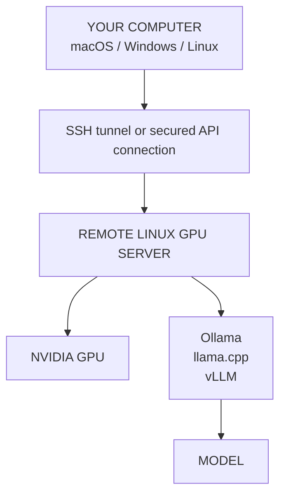

<p align="center">
  🇬🇧 <a href="README.md">English</a> &nbsp;|&nbsp; 🇻🇳 <a href="README.vi.md">Tiếng Việt</a> &nbsp;|&nbsp; 🇨🇳 <a href="README.zh-CN.md">中文</a>
</p>

<!-- SOURCE-REVISION: 3288716221 -->

---

<p align="center">
  
</p>

<h1 align="center">GPU Rental Kit</h1>

<p align="center">
  <strong>Turn a rented NVIDIA GPU VM into a ready-to-use self-hosted LLM server.</strong>
</p>

<p align="center">
  <a href="LICENSE"></a>
  <a href="https://github.com/TysonTranThai/gpu-rental-kit/releases"></a>
  <a href="https://github.com/TysonTranThai/gpu-rental-kit/actions"></a>
  
  
</p>

> [!IMPORTANT]
> **BETA — Windows client support is NOT yet tested on real Windows hardware.**
> Validated statically only; runtime testing pending.
> macOS/Linux server workflows are stable ([v1.3.0](https://github.com/TysonTranThai/gpu-rental-kit/releases/tag/v1.3.0)).

> **The simple idea:** the rented GPU server runs the model. Your own computer—Mac, Windows PC, or Linux machine—connects to that server. **Your personal computer does not need an NVIDIA GPU.**

> **The workflow: RENT → INSTALL → TEST → RUN.** Rent a Linux GPU VM, install everything with a few commands, verify the machine, and start running models.

## What is gpu-rental-kit?

`gpu-rental-kit` automates the setup of a rented Linux NVIDIA GPU machine for local/self-hosted LLM inference. It helps you go from a fresh GPU VM to a working model server without repeating the same manual setup each time.

It automates or assists with:

- GPU detection and CUDA validation
- Python virtual environments and GPU-aware PyTorch
- Ollama, llama.cpp, and vLLM runtimes
- Hugging Face model downloads and model aliases
- OpenAI-compatible inference servers
- Optional Docker GPU support
- Storage and persistence diagnostics
- Backups, restore helpers, logs, and health checks
- Local, mock, and real remote testing

The project is **provider-agnostic**: the provider can be any service that gives you SSH access to a Linux machine with a working NVIDIA GPU and internet access.

## Platform Support

Two environments matter here:

- **REMOTE GPU SERVER** — Linux with an NVIDIA GPU, CUDA, Ollama/llama.cpp/vLLM, models, and the inference API.
- **LOCAL USER COMPUTER** — Windows, macOS, or Linux. Runs the user-facing tools and connects over SSH/API. It does NOT need an NVIDIA GPU.

| Platform | Local Client | GPU Server |
|---|:---:|:---:|
| Windows | ✅ | ❌ current release |
| macOS | ✅ | ❌ NVIDIA server setup |
| Linux | ✅ | ✅ NVIDIA |

In other words: your computer can be any of the three, while the rented Linux machine runs the NVIDIA GPU.

### GPU Server

The rented machine that actually runs the model must currently be:

**Linux + NVIDIA GPU + working NVIDIA driver**

The toolkit's real GPU setup runs on that Linux server. **macOS is a development/test environment only**, and **Windows is not the target operating system for the GPU server in this release**. Both are fully supported as local client platforms — see below.

## Windows Support

**YES — Windows is a supported local client platform.** It ships its own installer (`bootstrap.ps1`) and its own native command set (`bin\*.ps1`).

### What gets installed

`bootstrap.ps1` prepares only LOCAL CLIENT tooling:

- Checks PowerShell version, architecture, and your Windows edition
- Verifies required tools: Git and the OpenSSH client
- Installs missing REQUIRED tools automatically via **winget** when available
- Detects optional items (Python, WSL2) and honestly reports them — none are required
- Docker Desktop is never required just to connect to a remote GPU server
- Creates `%USERPROFILE%\.gpu-rental-kit\` with a `client.json` connection profile
- Writes an installation log to `%USERPROFILE%\.gpu-rental-kit\install-*.log`

It stores ONLY host/port/user identity used to build `ssh` commands — never credentials.

### How to install

Open **Windows Terminal** (recommended) or PowerShell:

```powershell
git clone https://github.com/TysonTranThai/gpu-rental-kit.git
cd gpu-rental-kit
.\bootstrap.ps1
```

Common variants:

```powershell
.\bootstrap.ps1 -Help                                          # full help
.\bootstrap.ps1 -Yes                                           # non-interactive
.\bootstrap.ps1 -CheckOnly                                     # detect/report only, changes nothing
.\bootstrap.ps1 -RemoteHost 203.0.113.7 -RemoteUser ubuntu     # save connection details
```

If PowerShell refuses scripts, allow your own account once:

```powershell
Set-ExecutionPolicy -Scope CurrentUser RemoteSigned
```

Elevation is normally NOT needed. Only installing the (rarely missing) OpenSSH Client capability asks for an Administrator window — the script tells you exactly what to run instead of elevating silently.

The installer is idempotent: everything is checked before anything is installed, and existing `client.json` files are backed up (never silently overwritten).

### How to connect to a GPU server

```text
Windows PC
   |
   | SSH / API (tunnel)
   v
Linux GPU VM
   |
   v
NVIDIA GPU
   |
   v
LLM
```

```powershell
ssh user@SERVER_IP
# non-default SSH port:
ssh -p 2222 user@SERVER_IP
```

On the server, complete the real setup once (see [Quick start](#5-minute-quick-start)):

```bash
git clone https://github.com/TysonTranThai/gpu-rental-kit.git && cd gpu-rental-kit
./bootstrap.sh --remote-gpu
```

### How SSH tunneling works

Model servers bind to `127.0.0.1` on the LINUX SERVER for safety. A tunnel forwards a port from your PC to that private endpoint:

```powershell
ssh -N -L 8080:127.0.0.1:8080 user@SERVER_IP    # llama.cpp
ssh -N -L 8000:127.0.0.1:8000 user@SERVER_IP    # vLLM
```

Keep that window open. Verify from a second terminal:

```powershell
.\bin\api-status.ps1                 # checks http://127.0.0.1:<port>/v1/models
.\bin\api-status.ps1 -Port 8080      # one specific local port
```

### How to use the model

```powershell
.\bin\model-list.ps1                       # what's on the server
.\bin\model-download.ps1 llama3.1-8b       # download remotely
.\bin\ai-start.ps1 ollama llama3.1:8b      # interactive remote session
.\bin\model-run.ps1 llama3.1:8b            # auto-detected backend
.\bin\gpu-status.ps1                       # REMOTE hardware overview
.\bin\ai-stop.ps1                          # stop the runtime
.\bin\ai-backup.ps1 -Download              # back up AND pull tarball here
```

`bin\*.ps1` commands run the identically named bash command ON THE CONFIGURED REMOTE SERVER over SSH. They are clearly labeled `(REMOTE)` and **never inspect a local Windows GPU** — `gpu-status.ps1` reports the server's GPU, because that is where inference happens. Configure once with `-RemoteHost` or per-session with `$env:GRK_REMOTE_HOST='...'; $env:GRK_REMOTE_USER='...'`.

### Do you need WSL2, Docker Desktop, or an NVIDIA GPU?

- **WSL2:** optional, detected only if present; no workflow requires it.
- **Docker Desktop:** NOT needed to connect to or use a remote GPU server.
- **NVIDIA GPU:** NOT needed on the Windows PC — inference runs on the rented Linux server.

## 5-minute quick start

### 1. Rent a Linux NVIDIA GPU VM

Choose a machine with an NVIDIA GPU, a working driver, SSH access, internet access, and enough disk for your model. Ubuntu 20.04/22.04/24.04 and Debian 11/12 are the primary supported environments.

### 2. SSH into the GPU server

Replace the username, host, and port with the values from your provider:

```bash
ssh user@SERVER_IP
# If SSH uses a non-default port:
ssh -p 2222 user@SERVER_IP
```

### 3. Clone the repository and bootstrap the server

Run these commands **inside the remote Linux GPU server**:

```bash
git clone https://github.com/TysonTranThai/gpu-rental-kit.git
cd gpu-rental-kit
./bootstrap.sh --remote-gpu
```

For an unattended run:

```bash
./bootstrap.sh --remote-gpu -y
```

The setup is intended to be rerunnable and reuses detected installations where possible. It does not install NVIDIA drivers blindly.

### 4. Verify the machine

After setup, open a new shell or load the command path, then run:

```bash
source ~/.bashrc
gpu-status
gpu-test
model-list
```

The full report is written to:

```bash
cat ~/ai/logs/machine-report.txt
```

### 5. Download a small model

The registry includes GGUF and Ollama examples. For a beginner-friendly Ollama workflow:

```bash
model-download llama3.1-8b
```

For llama.cpp, download a GGUF alias:

```bash
model-download llama3-8b-gguf
```

Check the available aliases with `model-list` and remember that model downloads consume disk space.

### 6. Start inference

Ollama is the easiest place to begin:

```bash
ai-start ollama llama3.1:8b
```

For a GGUF model with the primary llama.cpp runtime:

```bash
ai-start llama ~/ai/models/llama3-8b-gguf/llama-3-8b-instruct.Q4_K_M.gguf
```

For vLLM:

```bash
ai-start vllm Qwen/Qwen2.5-7B-Instruct
```

### 7. Connect from your own computer

For beginners, keep the server bound to localhost and create an SSH tunnel from your Mac, Windows PC, or Linux computer. The model stays on the remote GPU server; your local computer sends requests to it.

## How the pieces fit together



In plain English: your computer is the client, while the rented Linux machine is the model server. The server loads the model into GPU memory and performs inference. SSH, an API request, or an SSH tunnel carries requests and responses between the two machines.

## Runtime choices

Start with **Ollama** if you are new. It provides the simplest model download and run experience.

| Runtime | What it is good for | Typical command |
|---|---|---|
| **Ollama** | Easiest beginner workflow and simple model management | `ai-start ollama llama3.1:8b` |
| **llama.cpp** | GGUF models, lightweight serving, CUDA acceleration, and detailed control | `ai-start llama /path/to/model.gguf` |
| **vLLM** | Higher-throughput model serving and an OpenAI-compatible API | `ai-start vllm Qwen/Qwen2.5-7B-Instruct` |

**llama.cpp is the primary runtime in this project.** Ollama and vLLM are optional alternatives. If an optional runtime is unavailable, a working llama.cpp installation remains the important baseline.

## Language selection

The installer asks for your preferred language as its **first step** (before any installation output):

```
Select your language / Chọn ngôn ngữ / 选择语言
  1) English
  2) Tiếng Việt
  3) 中文
```

Supported languages: `en` (English), `vi` (Tiếng Việt), `zh-CN` (简体中文).

For unattended installs, pass the language explicitly or via environment variable — the selector is skipped:

```bash
./bootstrap.sh --remote-gpu --lang vi
# or
GPU_KIT_LANG=zh-CN ./bootstrap.sh --remote-gpu
```

Your choice is saved to `~/ai/config/language.conf` and reused on the next run (with a non-intrusive "use saved language? [Y/n]" offer). An explicit `--lang` always wins. Adding a new installer language requires only a new `config/i18n/<code>.env` catalog plus one line in `config/i18n/languages.conf` — no installer-code changes.

## AI Routers (9Router + OmniRoute)

Optionally, the installer can set up two OpenAI-compatible AI routers that sit in front of your model servers:

| Router | What it does | Default port | Upstream |
|---|---|---|---|
| **9Router** | Local dashboard + OpenAI-compatible API routing | 20128 | [decolua/9router](https://github.com/decolua/9router) |
| **OmniRoute** | Multi-provider routing dashboard | 20128 | [diegosouzapw/OmniRoute](https://github.com/diegosouzapw/OmniRoute) |

Both are installed with `npm install -g` (9Router needs Node ≥ 18, OmniRoute needs Node ≥ 22 — the installer provisions Node 22 if missing), bound to `127.0.0.1` only, and health-checked before the installer reports success. If a component fails, the summary reports `INSTALL FAILED` with the reason instead of a false success.

### Router management

```bash
ai-router status              # 9Router: RUNNING / OmniRoute: STOPPED / ...
ai-router start 9router       # start one router
ai-router stop omniroute      # stop one router
ai-router logs 9router        # tail router logs
ai-router health omniroute    # HTTP health probe
```

`ai-start` (menu option 6) and `ai-stop` also manage routers. Routers are optional: set `ROUTER_9ROUTER_ENABLED=no` / `ROUTER_OMNIROUTE_ENABLED=no` in `~/ai/config/defaults.env` to disable, and `ROUTER_9ROUTER_PORT` / `ROUTER_OMNIROUTE_PORT` to change ports.

### Port conflicts

If port 20128 is already in use, the installer asks: pick another port automatically, stop the conflicting service (after explicit confirmation), or cancel. It **never** kills an unknown process on its own.

### Remote access (SSH tunnels)

Routers bind to `127.0.0.1` on the GPU server. To reach them from your own computer, open an SSH tunnel:

```bash
# macOS / Linux
ssh -N -L 20128:127.0.0.1:20128 user@SERVER_IP

# Windows PowerShell
ssh -N -L 20128:127.0.0.1:20128 user@SERVER_IP
```

Then point your browser or client at `http://127.0.0.1:20128`. Replace `SERVER_IP` with your server's address; never expose the routers on `0.0.0.0` unless you understand the security implications — the installer never opens firewall ports automatically.

## Multi-GPU support

If your machine has multiple NVIDIA GPUs, gpu-rental-kit can use them together **where the selected inference runtime supports it**.

### One model across multiple GPUs (sharding)

Example: 2 × RTX 3090 = 24GB + 24GB ≈ **48GB aggregate VRAM**. A model that does not fit in one GPU may be sharded across both:

```bash
# Shard across all GPUs:
model-run big-model --gpus all
# Shard across specific GPUs:
model-run big-model --gpus 0,1
# Let the toolkit choose from an estimated model size:
model-run llama3-70b --gpus auto --size-gb 40
# See whether a model fits before running anything:
model-run llama3-70b --fit --size-gb 40
```

What happens per backend:

| Backend | Multi-GPU mechanism | Notes |
|---|---|---|
| **llama.cpp** | Layer split across visible GPUs (automatic) | GGUF layer offloading; `CUDA_VISIBLE_DEVICES` selects the GPUs |
| **vLLM** | Tensor parallelism (`--tensor-parallel-size N`, injected automatically) | Requires an appropriate model architecture |
| **Ollama** | Splits large models across visible GPUs automatically | No manual flags needed |
| **PyTorch** | `CUDA_VISIBLE_DEVICES` / per-device tensors | Used by the toolkit for selection and tests |
| **Docker** | `NVIDIA_VISIBLE_DEVICES=all` or `0,1` | See `docker/compose.yml` |

### Choosing GPUs automatically (`--gpus auto`)

Auto mode never blindly consumes every GPU. It inspects what is running, prefers the smallest set of identical high-VRAM GPUs that fits the estimated requirement, and explains its decision:

```bash
model-run llama3-70b --gpus auto --size-gb 40
```

On a machine with 2 × RTX 3090 (24GB) + RTX 3050 (8GB) and a ~40GB model, the toolkit picks the two 3090s and tells you why:

```text
GPU system:
  3 GPU(s) detected
  GPU 0: NVIDIA GeForce RTX 3090 — 24GB
  GPU 1: NVIDIA GeForce RTX 3090 — 24GB
  GPU 2: NVIDIA GeForce RTX 3050 — 8GB
Model estimated requirement: ~40 GB (ESTIMATE — includes headroom; not a guarantee)
Recommended configuration: GPU 0 (NVIDIA GeForce RTX 3090, 24GB), GPU 1 (...)
Reason: ...
GPU 0: enabled
GPU 1: enabled
GPU 2: excluded — not needed — the model fits on the selected GPUs
```

Auto mode also respects work that is already running: a GPU with active compute processes (another LLM, ComfyUI, embeddings, training) is avoided when the remaining GPUs can cover the model.

Sharding vs workload parallelism can be forced explicitly:

```bash
model-run M --gpus 0,1 --gpu-mode shard      # one model across both GPUs (default)
model-run M --gpus 0,1 --gpu-mode workload   # never shard: best single GPU from the set
```

Environment-based configuration works too (used only when no explicit flag is given):

```bash
GPU_MODE=auto GPU_IDS=0,1 model-run llama3-70b --size-gb 40
GPU_IDS=all model-run big-model              # restrict the visible GPU set
```

After launching, verify the runtime is actually using the requested GPUs:

```bash
gpu-status --expect 0,1
```

This reports REQUESTED / VISIBLE / ACTIVE GPUs and warns when a requested GPU has no compute memory allocated — a multi-GPU launch is only successful when the intended GPUs actually carry model memory.

### Mixed GPUs (heterogeneous setups)

**Yes — different NVIDIA GPUs in one machine are supported.** RTX 3090 + RTX 3050 (24GB + 8GB = 32GB *aggregate* VRAM) works, but think about *how* to use it:

- **Strategy A — model sharding:** one model split across both GPUs. llama.cpp supports this; weight the split proportionally to VRAM (the toolkit suggests `--tensor-split 24,8`). The smaller GPU is both a memory contributor and a speed bottleneck.
- **Strategy B — separate workloads (often better):** the RTX 3090 runs the primary model, the RTX 3050 runs embeddings / a reranker / a smaller model. Different GPUs doing different jobs avoids the bottleneck entirely.

gpu-rental-kit classifies the machine automatically (`gpu-status` shows the configuration type):

| Configuration | Example | Meaning |
|---|---|---|
| `single` | 1 × RTX 3090 | One GPU |
| `homogeneous` | 3 × RTX 3090 | Identical GPUs |
| `heterogeneous` | RTX 3090 + RTX 3060 | Same architecture, different VRAM/model |
| `mixed-architecture` | RTX 3090 + RTX 4090 | Different architectures (e.g. Ampere + Ada) |

Per-backend heterogeneous verdicts (shown by `model-run` when the selected GPU set is mixed):

| Backend | Heterogeneous sharding | Toolkit verdict |
|---|---|---|
| **llama.cpp** | Layer/tensor split across different GPUs | SUPPORTED (VRAM-proportional split recommended) |
| **Ollama** | Automatic split, no manual control | PARTIAL |
| **vLLM** | Tensor parallelism expects identical GPUs | CAUTION — prefer llama.cpp or workload distribution |
| **PyTorch** | Model-specific multi-GPU code | SUPPORTED (device selection) |
| **Docker** | Exposes all/selected GPUs; backend inside decides | SUPPORTED |

Verdicts reflect each backend's documented behavior. Capabilities not verified on real multi-GPU hardware are reported as NEEDS VERIFICATION rather than upgraded to SUPPORTED — see [Testing](#testing).

### Benchmarking (optional)

```bash
gpu-test --bench        # micro-benchmark: per-GPU matmul GFLOPS + P2P bandwidth
```

`--bench` never runs by default. It reports raw compute and copy numbers — these are NOT language-model tokens/s and do not predict end-to-end LLM speed on their own.

### Multiple models on different GPUs (workload parallelism)

One GPU per workload — no sharding involved:

```bash
model-run model-a --gpu 0
model-run model-b --gpu 1
```

### Inspecting GPUs

```bash
gpu-list              # every GPU: name, VRAM, compute capability, PCI bus
gpu-topology          # NVLink/PCIe interconnect (when the platform reports it)
gpu-status            # live status incl. per-GPU usage and MULTI-GPU mode
gpu-test --multi      # deeper multi-GPU tests (per-GPU CUDA, P2P report)
```

### Important — what multi-GPU does and does not do

> **Aggregate VRAM is NOT pooled.** 2 × 24GB gives ~48GB of *aggregate* memory across two separate GPUs — it does **not** create one 48GB GPU. Whether a model can use the aggregate depends on the backend's sharding/offloading support and the model architecture.

- **Multi-GPU does not always mean 2 GPUs = 2× speed.** Performance depends on the model, backend, tensor parallelism, interconnect (PCIe vs NVLink), batch size, context length, and workload. Multi-GPU often lets a model *fit* rather than making it faster.
- **Mixed GPUs work but the smaller/slower GPU becomes the bottleneck.** gpu-rental-kit detects mixed setups and warns you.
- **The default is always single GPU.** Multi-GPU is enabled only when you explicitly pass `--gpus`. Existing `CUDA_VISIBLE_DEVICES` values are always respected.

## Windows Users

### Can I use this from Windows?

**Yes.** Rent a Linux NVIDIA GPU server, connect to it from Windows, and run the GPU setup on the Linux server. Your Windows computer is the client; it does not run the Linux GPU setup natively and does not need an NVIDIA GPU.

Windows 10 and 11 commonly include OpenSSH through Windows Terminal or PowerShell:

```powershell
ssh user@SERVER_IP
# Non-default SSH port:
ssh -p 2222 user@SERVER_IP
```

Once connected, run on the server:

```bash
git clone https://github.com/TysonTranThai/gpu-rental-kit.git
cd gpu-rental-kit
./bootstrap.sh --remote-gpu
```

To use an API through an SSH tunnel, open a second Windows Terminal window and forward the server's localhost port. For llama.cpp's default port:

```powershell
ssh -N -L 8080:127.0.0.1:8080 user@SERVER_IP
```

Keep that window open. Windows applications can then use `http://127.0.0.1:8080` as the local end of the tunnel. WSL2 is **optional**, not mandatory; Windows Terminal, PowerShell, and OpenSSH are enough for the SSH workflow.

## macOS Users

A Mac can manage and use the remote GPU server, and it does not need an NVIDIA GPU. Do **not** run `./bootstrap.sh --remote-gpu` on macOS. Instead, SSH into the Linux GPU server and run it there:

```bash
ssh user@SERVER_IP
git clone https://github.com/TysonTranThai/gpu-rental-kit.git
cd gpu-rental-kit
./bootstrap.sh --remote-gpu
```

On macOS, running `./bootstrap.sh` without `--remote-gpu` opens the development menu — an equivalent local bootstrap experience to Windows' `bootstrap.ps1`. You can also run the Mac-safe checks directly:

```bash
./bootstrap.sh --validate
./bootstrap.sh --test
```

To forward llama.cpp's default API port to your Mac:

```bash
ssh -N -L 8080:127.0.0.1:8080 user@SERVER_IP
```

Then use `http://127.0.0.1:8080` from a Mac application while the tunnel is open.

## Remote API access

The runtimes use localhost-safe defaults:

- **llama.cpp:** `127.0.0.1:8080`
- **vLLM:** `127.0.0.1:8000/v1`
- **Ollama:** `127.0.0.1:11434`

### A. SSH tunnel — recommended for beginners

Run this on your personal computer:

```bash
# llama.cpp
ssh -N -L 8080:127.0.0.1:8080 user@SERVER_IP

# vLLM instead
ssh -N -L 8000:127.0.0.1:8000 user@SERVER_IP
```

The remote service remains private, and your local application connects to `localhost`.

### B. Public IP and port — advanced

You can deliberately bind a service to `0.0.0.0` and permit a provider firewall port, but this is not recommended for a first setup. Configure authentication where supported and restrict source IPs. Do not expose Ollama's raw port 11434 to the public internet without a carefully secured network design.

### C. Domain + HTTPS — advanced/future deployment

For a long-running public service, place an authenticated HTTPS reverse proxy in front of the model server and add TLS, firewall restrictions, rate limiting, monitoring, and backups. A domain is not required for SSH tunneling.

## OpenAI-compatible APIs: what that means

An OpenAI-compatible API is an HTTP interface with familiar endpoints such as `/v1/chat/completions`. Applications that know how to talk to an OpenAI API can often be configured to send inference requests to your remote vLLM or llama.cpp server instead of running a model locally.

This provides **model inference only**. It does **not** automatically give the remote model access to your personal computer's files, terminal, filesystem, Git repository, or other tools.

Keep the roles separate:

- **Model server:** loads the model and generates responses.
- **Local client:** owns local tools, files, terminal, and Git access.

Any tool access must be intentionally implemented and permissioned by the client application.

## Security warning

> **Never expose an unauthenticated LLM API to the public internet.**

Recommended order of preference:

1. Use an SSH tunnel for personal access.
2. If public access is required, use HTTPS, authentication, rate limiting, firewall/network restrictions, and a carefully scoped reverse proxy.
3. Keep Ollama's raw `11434` port private unless you have explicitly secured it.
4. Never commit API keys, provider credentials, or model hub tokens.

The toolkit defaults services to `127.0.0.1`, does not open public ports by itself, and does not install NVIDIA drivers blindly.

Local-capability separation: connecting a client to the server never grants that server access to your computer's filesystem, shell, or credentials. On Windows this means `C:\`, Documents, Desktop, SSH keys, browser data, and stored passwords stay on your PC — nothing is ever shared automatically with the remote GPU server, no matter what API it exposes. Any future agent-style tool access must be explicitly implemented and permissioned client-side by you.

## Storage and rental warning

Rented GPU machines may be disposable. Local disk persistence is provider- and rental-dependent. The toolkit intentionally reports:

```text
PERSISTENCE UNKNOWN — DO NOT RELY ON LOCAL STORAGE
```

Before ending a rental:

- back up configuration and scripts with `ai-backup`
- back up important models/data with `ai-backup --include-models` when practical
- copy critical backups off the rented machine
- verify the provider's persistence policy rather than assuming the disk survives deletion

## Command reference

These are the commands installed into `~/ai/bin` by setup:

| Command | Purpose |
|---|---|
| `bootstrap.sh` | Main setup, validation, and test entry point |
| `gpu-status` | Show GPU, driver, CUDA, and runtime status (`--expect 0,1` verifies requested GPUs are actually used) |
| `gpu-list` | List every GPU with name, VRAM, compute capability, PCI bus, and UUID |
| `gpu-topology` | Show GPU interconnect (NVLink/PCIe) and NUMA affinity when reported |
| `gpu-test` | Run GPU compute checks (`--multi` multi-GPU tests, `--bench` optional micro-benchmark) |
| `model-list` | List registered model aliases and downloaded models |
| `model-download` | Download a registered alias, Hugging Face model, or Ollama model |
| `model-run` | Run a model using Ollama, vLLM, or llama.cpp (`--gpu N`, `--gpus all\|0,1\|auto`, `--gpu-mode shard\|workload`, `--size-gb N`, `--fit`) |
| `model-stop` | Stop a running model process |
| `ai-start` | Start Ollama, vLLM, or llama.cpp; GPU flags (`--gpus 0,1`, `--gpu 0`, ...) are delegated to model-run |
| `ai-stop` | Stop the active AI runtime |
| `ai-router` | Manage AI routers (9Router / OmniRoute): `status`, `start`, `stop`, `logs`, `health` |
| `ai-info` | Show AI environment information |
| `ai-backup` | Back up configuration; `--include-models` includes model files |

Windows equivalents live in `bin\*.ps1` and use the SAME names (`gpu-status.ps1`, `gpu-test.ps1`, `model-list.ps1`, `model-download.ps1`, `model-run.ps1`, `model-stop.ps1`, `ai-start.ps1`, `ai-stop.ps1`, `ai-info.ps1`, `ai-backup.ps1`), plus `api-status.ps1` for tunnel checks. They execute against the configured REMOTE server over SSH — see [Windows Support](#windows-support).

Useful additional commands include `ai-logs`, `model-logs`, and `model-stop`.

## Common workflows

### I just rented a GPU

```bash
ssh user@SERVER_IP
git clone https://github.com/TysonTranThai/gpu-rental-kit.git
cd gpu-rental-kit
./bootstrap.sh --remote-gpu
source ~/.bashrc
gpu-status
gpu-test
```

### I want to run Ollama

```bash
model-download llama3.1-8b
ai-start ollama llama3.1:8b
```

Ollama listens on localhost port `11434` by default. Use an SSH tunnel rather than exposing that port publicly.

### I want llama.cpp

```bash
model-download llama3-8b-gguf
model-list
# Use the actual .gguf path shown in ~/ai/models:
ai-start llama ~/ai/models/llama3-8b-gguf/llama-3-8b-instruct.Q4_K_M.gguf
```

llama.cpp is the primary runtime and serves localhost port `8080` by default.

### I want an OpenAI-compatible API

For vLLM:

```bash
ai-start vllm Qwen/Qwen2.5-7B-Instruct
```

For llama.cpp, use a GGUF file:

```bash
ai-start llama ~/ai/models/my-model.gguf
```

Then forward the relevant localhost port with SSH. vLLM uses `http://127.0.0.1:8000/v1`; llama.cpp uses `http://127.0.0.1:8080`.

### I want to connect from Windows

```powershell
ssh -N -L 8080:127.0.0.1:8080 user@SERVER_IP
```

Keep the tunnel open and point your local client at `http://127.0.0.1:8080`.

### I want to connect from Mac

```bash
ssh -N -L 8080:127.0.0.1:8080 user@SERVER_IP
```

The Mac is the client; the rented Linux machine is the GPU server.

### My rental is ending

```bash
ai-backup
ai-backup --include-models
ai-backup --list
```

Copy the resulting backup files to storage outside the rental before deleting the machine.

## Troubleshooting

| Symptom | Likely cause | Diagnose | Next step |
|---|---|---|---|
| `sudo: command not found` during setup | Minimal provider containers often ship without sudo | `id -u`; `command -v sudo` | Running as root? The toolkit runs privileged commands directly — no sudo needed. Non-root? Rerun as root, or install sudo (`apt-get install -y sudo`) |
| No NVIDIA GPU detected | Wrong machine/image, GPU not attached, or provider issue | `nvidia-smi` | Confirm the rental includes an NVIDIA GPU and ask the provider about passthrough |
| CUDA unavailable | Driver, CUDA/PyTorch mismatch, or broken environment | `nvidia-smi`; `~/ai/venv/bin/python -c 'import torch; print(torch.cuda.is_available())'` | Review the setup log; do not install a random driver over a provider image |
| SSH connection refused | Wrong IP/port, firewall, or SSH service unavailable | `ssh -vvv -p PORT user@SERVER_IP` | Verify provider connection details and allow the configured SSH port |
| Port already in use | Another runtime or process owns 8080/8000/11434 | `ss -ltnp \| grep -E ':8080|:8000|:11434'` | Stop the old service with `ai-stop`, or choose a different runtime port |
| Model too large for VRAM | Model weights/context exceed available GPU memory | `gpu-status`; inspect the model size and VRAM | Use a smaller or quantized model, reduce context, or use a larger GPU |
| Out of disk space | Models/cache/logs filled the rental disk | `df -h`; `du -sh ~/ai/*` | Remove unused models/cache or rent a larger disk |
| Docker GPU unavailable | Docker or NVIDIA Container Toolkit is missing/incompatible | `docker run --rm --gpus all nvidia/cuda:12.4.0-base-ubuntu22.04 nvidia-smi` | Use native execution, or install the provider-compatible Docker GPU components |
| API cannot be reached | Service stopped, wrong port, or tunnel missing | `curl http://127.0.0.1:8080/health`; `ss -ltnp` | Check `ai-logs`, start the correct runtime, and verify the SSH tunnel |
| Setup hangs on service start | Minimal containers have no systemd | `command -v systemctl` | Services start via runtime wrappers (`ai-start`, `llamacpp-serve`, `vllm-serve`); no systemd required |
| Ollama fails to install | Missing extraction prerequisite or network/package issue | `command -v zstd`; `cat ~/ai/logs/setup-*.log` | Rerun bootstrap; zstd is handled automatically on supported package-manager systems |
| Windows: script won't run | PowerShell execution policy | `Get-ExecutionPolicy -Scope CurrentUser` | `Set-ExecutionPolicy -Scope CurrentUser RemoteSigned`, then rerun `bootstrap.ps1` |
| Windows: winget missing | Older Windows build without App Installer | `winget --version` in PowerShell | Install Git/SSH manually (git-scm.com, OpenSSH capability) and rerun `-CheckOnly` |
| Windows: ssh not found | Optional OpenSSH Client capability absent | `ssh -V` in PowerShell | Add-WindowsCapability -Online -Name OpenSSH.Client~~~~0.0.1.0 from an Administrator PowerShell |
| Windows: API unreachable through tunnel | Tunnel closed or wrong port | `.\bin\api-status.ps1` | Reopen the ssh tunnel window, check the port matches llama.cpp (8080) / vLLM (8000) |

View logs with:

```bash
ai-logs
model-logs all
cat ~/ai/logs/setup-*.log
```

## FAQ

**Can I use this on Windows?**
Yes—as a client connecting to a Linux NVIDIA GPU server. The GPU setup itself runs on Linux.

**Does my PC need an NVIDIA GPU?**
No. The remote server can run the model and your computer can connect to it.

**Can I use a Mac?**
Yes. Use the Mac as a client and development/test computer, and run the real GPU setup after SSH-ing into the Linux server.

**Can I run the GPU setup directly on macOS?**
No. Do not run `./bootstrap.sh --remote-gpu` on macOS. Use the Mac-safe validation/test workflow locally and run the GPU setup remotely.

**Do I need Docker?**
No. Native execution is the default. Docker support is optional for Docker-based workflows.

**Do I need a domain?**
No. SSH tunneling is usually easiest. A public IP and port can work with appropriate security, and a domain is an advanced HTTPS option.

**Will my models survive when the rental ends?**
Not guaranteed. Check the provider's persistence policy and copy important models and backups elsewhere.**Does the API automatically let the model control my computer?**

No. The API provides inference. Local files, terminal, tools, and Git remain separate client-side capabilities.

**Do I need WSL2 to use gpu-rental-kit from Windows?**

No. `bootstrap.ps1` uses native Windows tools (PowerShell, Git, OpenSSH). WSL2 is detected only if present and never required.

**Do I need Docker Desktop?**

No for remote workflows — connecting to and using a remote GPU server needs only SSH plus an API client. Docker matters solely if you choose the optional Docker-based setup path ON THE SERVER.

**Does `gpu-status.ps1` show my Windows PC's GPU?**

No — it shows the REMOTE Linux server's GPU status over SSH, honestly labeled `(REMOTE)`. The Windows client intentionally has no local NVIDIA inspection, because inference runs on the server.

**How do I install the local tools on Windows?**

```powershell
git clone https://github.com/TysonTranThai/gpu-rental-kit.git
cd gpu-rental-kit
.\bootstrap.ps1
```

It installs missing prerequisites via winget and writes `%USERPROFILE%\.gpu-rental-kit\client.json` when you pass `-RemoteHost ...`.

## Supported environments and limitations

- **GPU runtime:** Linux with a working NVIDIA driver and CUDA-capable GPU
- **Primary distro targets:** Ubuntu 20.04/22.04/24.04 and Debian 11/12
- **Client computers:** macOS, Windows, and Linux via SSH/API
- **Linux roles:** BOTH remote GPU-server installation (`bootstrap.sh --remote-gpu`) and everyday local client usage
- **macOS:** local client + development/test environment only; no NVIDIA GPU setup
- **Windows:** first-class local client with `bootstrap.ps1`; not a Linux GPU-server target in this release
- **AMD/Intel GPU:** no ROCm or oneAPI setup path in this release
- **NVIDIA driver installation:** intentionally not automated because provider images and reboots vary
- **Docker:** optional; native execution does not require Docker

## Project layout

```text
gpu-rental-kit/
├── bootstrap.sh            # macOS dev menu + Linux GPU-server entry point
├── bootstrap.ps1           # Windows LOCAL CLIENT installer (per-platform twin)
├── setup.sh                # Linux GPU setup orchestrator
├── config/                 # defaults.env + models.yaml (shared conceptual config)
├── scripts/                # detection, setup, runtime, backup, diagnostics (server)
├── bin/                    # bash commands (server) + .ps1 Windows client twins
├── docker/                 # optional Docker GPU files
├── docs/                   # documentation assets
└── test/                   # local, mock, and real remote tests
```

## Testing

Run these on a development computer or Linux server:

```bash
./test/run_all.sh local
./test/run_all.sh mock
./test/run_all.sh all
```

`local` and `mock` do not require an NVIDIA GPU. Real GPU and remote tests require a configured remote target and are skipped honestly when none is available. The harness labels mock, real, pass, fail, and skipped results separately.

Windows tooling has its own suite entry (`test/tests/test_windows_client.sh`): it structurally validates every `.ps1` file and parses them with the real PowerShell parser whenever `pwsh` is installed. Where pwsh is absent (e.g. macOS CI hosts), validation stays static and the output says so — Windows RUNTIME results are never simulated.

For contribution guidance, see [CONTRIBUTING.md](CONTRIBUTING.md). For vulnerability reporting, see [SECURITY.md](SECURITY.md).

## Contributing

Contributions are welcome — bug fixes, new mock GPU profiles, provider setup notes, and documentation improvements all help. The project values simplicity, honesty, and portability.

1. Fork the repository and create a feature branch.
2. Make your changes, keeping them focused and well-tested.
3. Run the test suite before submitting:

   ```bash
   ./test/run_all.sh all
   ```

4. Open a pull request describing what changed and why.

See [CONTRIBUTING.md](CONTRIBUTING.md) for the full guide, including the pull request checklist.

## License

[MIT](LICENSE) — free to use, modify, and distribute.
