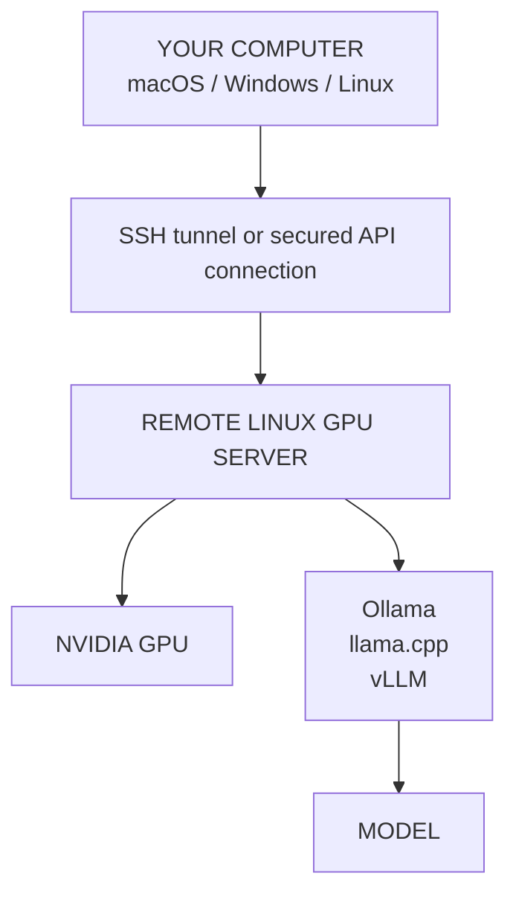

<p align="center">
  🇬🇧 <a href="README.md">English</a> &nbsp;|&nbsp; 🇻🇳 <a href="README.vi.md">Tiếng Việt</a> &nbsp;|&nbsp; 🇨🇳 <a href="README.zh-CN.md">中文</a>
</p>

<!-- SOURCE-REVISION: 3288716221 -->

---

<p align="center">
  
</p>

<h1 align="center">GPU Rental Kit</h1>

<p align="center">
  <strong>Biến một GPU VM thuê (NVIDIA) thành máy chủ LLM tự lưu trữ, sẵn sàng dùng ngay.</strong>
</p>

<p align="center">
  <a href="LICENSE"></a>
  <a href="https://github.com/TysonTranThai/gpu-rental-kit/releases"></a>
  <a href="https://github.com/TysonTranThai/gpu-rental-kit/actions"></a>
  
  
</p>

> [!IMPORTANT]
> **BETA — hỗ trợ Windows client CHƯA được kiểm thử trên máy Windows thật.**
> Mới chỉ được kiểm tra tĩnh (cấu trúc, cú pháp); kiểm thử chạy thực tế đang chờ.
> Quy trình máy chủ trên macOS/Linux đã ổn định ([v1.3.0](https://github.com/TysonTranThai/gpu-rental-kit/releases/tag/v1.3.0)).

> **Ý tưởng đơn giản:** máy chủ GPU thuê chạy model. Máy tính của bạn — Mac, PC Windows hay máy Linux — chỉ cần kết nối tới máy chủ đó. **Máy tính cá nhân của bạn KHÔNG cần có NVIDIA GPU.**

> **Quy trình làm việc: THUÊ → CÀI ĐẶT → KIỂM TRA → CHẠY.** Thuê một GPU VM chạy Linux, cài đặt mọi thứ chỉ với vài lệnh, kiểm tra máy, rồi bắt đầu chạy model.

## gpu-rental-kit là gì?

`gpu-rental-kit` tự động hóa việc thiết lập một máy Linux có NVIDIA GPU (thuê theo giờ) cho nhu cầu chạy LLM cục bộ/tự lưu trữ. Công cụ giúp bạn đi từ một GPU VM trống trơn tới một máy chủ model hoạt động, không phải lặp lại các bước cài đặt thủ công mỗi lần.

Công cụ tự động hóa hoặc hỗ trợ:

- Phát hiện GPU và kiểm tra CUDA
- Môi trường ảo Python và PyTorch hỗ trợ GPU
- Các runtime Ollama, llama.cpp và vLLM
- Tải model từ Hugging Face và đặt bí danh (alias) cho model
- Máy chủ suy luận (inference) tương thích OpenAI
- Hỗ trợ Docker GPU (tùy chọn)
- Chẩn đoán lưu trữ và độ bền dữ liệu
- Sao lưu, phục hồi, log và kiểm tra sức khỏe hệ thống
- Kiểm thử cục bộ, với mock, và từ xa thực tế

Dự án **không phụ thuộc nhà cung cấp (provider-agnostic)**: nhà cung cấp có thể là bất kỳ dịch vụ nào cho bạn quyền SSH vào một máy Linux có NVIDIA GPU hoạt động và có internet.

## Nền tảng được hỗ trợ

Có hai môi trường quan trọng:

- **MÁY CHỦ GPU TỪ XA (REMOTE GPU SERVER)** — Linux với NVIDIA GPU, CUDA, Ollama/llama.cpp/vLLM, model và API suy luận.
- **MÁY TÍNH NGƯỜI DÙNG CỤC BỘ (LOCAL USER COMPUTER)** — Windows, macOS hoặc Linux. Chạy các công cụ dành cho người dùng và kết nối qua SSH/API. Máy này KHÔNG cần NVIDIA GPU.

| Nền tảng | Client cục bộ | GPU Server |
|---|:---:|:---:|
| Windows | ✅ | ❌ bản hiện tại |
| macOS | ✅ | ❌ thiết lập NVIDIA server |
| Linux | ✅ | ✅ NVIDIA |

Nói cách khác: máy tính của bạn có thể là bất kỳ hệ điều hành nào trong ba hệ điều hành trên, còn máy Linux thuê mới chạy NVIDIA GPU.

### GPU Server

Máy thuê thực sự chạy model phải đáp ứng:

**Linux + NVIDIA GPU + driver NVIDIA hoạt động**

Việc thiết lập GPU thực sự của bộ công cụ chạy trên máy chủ Linux đó. **macOS chỉ là môi trường phát triển/kiểm thử**, còn **Windows không phải hệ điều hành đích cho GPU server trong bản này**. Cả hai đều được hỗ trợ đầy đủ ở vai trò client cục bộ — xem bên dưới.

## Hỗ trợ Windows

**CÓ — Windows là nền tảng client cục bộ được hỗ trợ.** Windows có bộ cài riêng (`bootstrap.ps1`) và bộ lệnh gốc riêng (`bin\*.ps1`).

### Những gì được cài đặt

`bootstrap.ps1` chỉ chuẩn bị CÔNG CỤ CLIENT CỤC BỘ:

- Kiểm tra phiên bản PowerShell, kiến trúc và edition Windows
- Kiểm tra các công cụ bắt buộc: Git và OpenSSH client
- Tự động cài các công cụ BẮT BUỘC còn thiếu qua **winget** khi có sẵn
- Phát hiện các thành phần tùy chọn (Python, WSL2) và báo cáo trung thực — không cái nào là bắt buộc
- Không bao giờ yêu cầu Docker Desktop chỉ để kết nối tới một máy chủ GPU từ xa
- Tạo `%USERPROFILE%\.gpu-rental-kit\` kèm hồ sơ kết nối `client.json`
- Ghi log cài đặt vào `%USERPROFILE%\.gpu-rental-kit\install-*.log`

Nó chỉ lưu host/port/user dùng để dựng lệnh `ssh` — không bao giờ lưu thông tin đăng nhập.

### Cách cài đặt

Mở **Windows Terminal** (khuyên dùng) hoặc PowerShell:

```powershell
git clone https://github.com/TysonTranThai/gpu-rental-kit.git
cd gpu-rental-kit
.\bootstrap.ps1
```

Các biến thể thường dùng:

```powershell
.\bootstrap.ps1 -Help                                          # xem toàn bộ trợ giúp
.\bootstrap.ps1 -Yes                                           # chạy không cần thao tác
.\bootstrap.ps1 -CheckOnly                                     # chỉ phát hiện/báo cáo, không thay đổi gì
.\bootstrap.ps1 -RemoteHost 203.0.113.7 -RemoteUser ubuntu     # lưu thông tin kết nối
```

Nếu PowerShell từ chối chạy script, hãy cho phép một lần trên tài khoản của bạn:

```powershell
Set-ExecutionPolicy -Scope CurrentUser RemoteSigned
```

Thông thường KHÔNG cần quyền quản trị. Chỉ khi cài khả năng OpenSSH Client (hiếm khi thiếu) mới cần cửa sổ Administrator — script sẽ chỉ dẫn chính xác lệnh cần chạy thay vì tự nâng quyền.

Bộ cài có tính idempotent (chạy lại an toàn): mọi thứ được kiểm tra trước khi cài, và file `client.json` cũ luôn được sao lưu (không bao giờ ghi đè âm thầm).

### Cách kết nối tới GPU server

```text
Windows PC
   |
   | SSH / API (tunnel)
   v
Linux GPU VM
   |
   v
NVIDIA GPU
   |
   v
LLM
```

```powershell
ssh user@SERVER_IP
# SSH dùng port không mặc định:
ssh -p 2222 user@SERVER_IP
```

Trên server, hoàn tất thiết lập thật một lần (xem [Bắt đầu nhanh trong 5 phút](#bắt-đầu-nhanh-trong-5-phút)):

```bash
git clone https://github.com/TysonTranThai/gpu-rental-kit.git && cd gpu-rental-kit
./bootstrap.sh --remote-gpu
```

### SSH tunneling hoạt động thế nào

Máy chủ model ràng buộc vào `127.0.0.1` trên MÁY CHỦ LINUX vì lý do an toàn. Tunnel chuyển tiếp một port từ PC của bạn tới endpoint riêng tư đó:

```powershell
ssh -N -L 8080:127.0.0.1:8080 user@SERVER_IP    # llama.cpp
ssh -N -L 8000:127.0.0.1:8000 user@SERVER_IP    # vLLM
```

Giữ cửa sổ đó mở. Kiểm tra từ một terminal thứ hai:

```powershell
.\bin\api-status.ps1                 # kiểm tra http://127.0.0.1:<port>/v1/models
.\bin\api-status.ps1 -Port 8080      # một port cục bộ cụ thể
```

### Cách dùng model

```powershell
.\bin\model-list.ps1                       # xem trên server có gì
.\bin\model-download.ps1 llama3.1-8b       # tải model từ xa
.\bin\ai-start.ps1 ollama llama3.1:8b      # phiên làm việc tương tác từ xa
.\bin\model-run.ps1 llama3.1:8b            # backend tự phát hiện
.\bin\gpu-status.ps1                       # tổng quan phần cứng TỪ XA
.\bin\ai-stop.ps1                          # dừng runtime
.\bin\ai-backup.ps1 -Download              # sao lưu VÀ tải tarball về máy
```

Các lệnh `bin\*.ps1` chạy lệnh bash cùng tên TRÊN MÁY CHỦ TỪ XA đã cấu hình qua SSH. Chúng được gắn nhãn rõ ràng `(REMOTE)` và **không bao giờ kiểm tra GPU Windows cục bộ** — `gpu-status.ps1` báo cáo GPU của server, vì đó là nơi chạy suy luận. Cấu hình một lần bằng `-RemoteHost` hoặc theo phiên bằng `$env:GRK_REMOTE_HOST='...'; $env:GRK_REMOTE_USER='...'`.

### Bạn có cần WSL2, Docker Desktop hay NVIDIA GPU không?

- **WSL2:** tùy chọn, chỉ được phát hiện nếu có; không quy trình nào yêu cầu nó.
- **Docker Desktop:** KHÔNG cần để kết nối hoặc dùng máy chủ GPU từ xa.
- **NVIDIA GPU:** KHÔNG cần trên PC Windows — suy luận chạy trên máy chủ Linux thuê.

## Bắt đầu nhanh trong 5 phút

### 1. Thuê một GPU VM chạy Linux

Chọn máy có NVIDIA GPU, driver hoạt động, quyền SSH, internet và đủ dung lượng đĩa cho model. Ubuntu 20.04/22.04/24.04 và Debian 11/12 là các môi trường hỗ trợ chính.

### 2. SSH vào GPU server

Thay username, host và port bằng giá trị từ nhà cung cấp của bạn:

```bash
ssh user@SERVER_IP
# Nếu SSH dùng port không mặc định:
ssh -p 2222 user@SERVER_IP
```

### 3. Clone repository và bootstrap server

Chạy các lệnh này **bên trong máy chủ Linux GPU từ xa**:

```bash
git clone https://github.com/TysonTranThai/gpu-rental-kit.git
cd gpu-rental-kit
./bootstrap.sh --remote-gpu
```

Để chạy không cần giám sát:

```bash
./bootstrap.sh --remote-gpu -y
```

Quá trình thiết lập được thiết kế để chạy lại được và tái sử dụng các bản cài đặt đã phát hiện khi có thể. Nó không cài driver NVIDIA một cách mù quáng.

### 4. Kiểm tra máy

Sau khi thiết lập, mở shell mới hoặc nạp đường dẫn lệnh, rồi chạy:

```bash
source ~/.bashrc
gpu-status
gpu-test
model-list
```

Báo cáo đầy đủ được ghi vào:

```bash
cat ~/ai/logs/machine-report.txt
```

### 5. Tải một model nhỏ

Registry có sẵn ví dụ GGUF và Ollama. Với người mới, quy trình Ollama là dễ nhất:

```bash
model-download llama3.1-8b
```

Với llama.cpp, tải một bí danh GGUF:

```bash
model-download llama3-8b-gguf
```

Xem các bí danh có sẵn bằng `model-list` và nhớ rằng tải model sẽ tốn dung lượng đĩa.

### 6. Bắt đầu suy luận

Ollama là nơi dễ bắt đầu nhất:

```bash
ai-start ollama llama3.1:8b
```

Với model GGUF dùng runtime llama.cpp chính:

```bash
ai-start llama ~/ai/models/llama3-8b-gguf/llama-3-8b-instruct.Q4_K_M.gguf
```

Với vLLM:

```bash
ai-start vllm Qwen/Qwen2.5-7B-Instruct
```

### 7. Kết nối từ máy tính của bạn

Với người mới, hãy giữ server ràng buộc vào localhost và tạo SSH tunnel từ Mac, PC Windows hay máy Linux của bạn. Model nằm trên máy chủ GPU từ xa; máy tính cục bộ chỉ gửi yêu cầu tới nó.

## Các thành phần kết nối với nhau như thế nào



Nói đơn giản: máy tính của bạn là client, còn máy Linux thuê là máy chủ model. Server nạp model vào bộ nhớ GPU và thực hiện suy luận. SSH, một yêu cầu API hoặc SSH tunnel chuyển yêu cầu và phản hồi giữa hai máy.

## Lựa chọn runtime

Bắt đầu với **Ollama** nếu bạn mới. Nó mang lại trải nghiệm tải và chạy model đơn giản nhất.

| Runtime | Phù hợp cho | Lệnh điển hình |
|---|---|---|
| **Ollama** | Quy trình dễ nhất cho người mới và quản lý model đơn giản | `ai-start ollama llama3.1:8b` |
| **llama.cpp** | Model GGUF, serving nhẹ, tăng tốc CUDA và kiểm soát chi tiết | `ai-start llama /path/to/model.gguf` |
| **vLLM** | Serving model thông lượng cao và API tương thích OpenAI | `ai-start vllm Qwen/Qwen2.5-7B-Instruct` |

**llama.cpp là runtime chính của dự án này.** Ollama và vLLM là các lựa chọn thay thế tùy chọn. Nếu runtime tùy chọn không khả dụng, một bản cài llama.cpp hoạt động vẫn là nền tảng quan trọng.

## Lựa chọn ngôn ngữ

Trình cài đặt sẽ hỏi ngôn ngữ bạn muốn ngay ở **bước đầu tiên** (trước khi bắt đầu bất kỳ thông tin cài đặt nào):

```
Select your language / Chọn ngôn ngữ / 选择语言
  1) English
  2) Tiếng Việt
  3) 中文
```

Các ngôn ngữ được hỗ trợ: `en` (English), `vi` (Tiếng Việt), `zh-CN` (简体中文).

Với cài đặt không tương tác, truyền ngôn ngữ trực tiếp hoặc qua biến môi trường — màn hình chọn ngôn ngữ sẽ bị bỏ qua:

```bash
./bootstrap.sh --remote-gpu --lang vi
# hoặc
GPU_KIT_LANG=zh-CN ./bootstrap.sh --remote-gpu
```

Lựa chọn của bạn được lưu vào `~/ai/config/language.conf` và được dùng lại ở lần chạy tiếp theo (kèm một câu hỏi "dùng ngôn ngữ đã lưu? [Y/n]" không làm phiền). `--lang` rõ ràng luôn được ưu tiên. Thêm một ngôn ngữ cài đặt mới chỉ cần tạo `config/i18n/<code>.env` mới cộng một dòng trong `config/i18n/languages.conf` — không cần sửa code trình cài đặt.

## AI Routers (9Router + OmniRoute)

Tùy chọn, trình cài đặt có thể thiết lập hai AI router tương thích OpenAI đặt trước các máy chủ model của bạn:

| Router | Chức năng | Cổng mặc định | Nguồn |
|---|---|---|---|
| **9Router** | Dashboard cục bộ + API tương thích OpenAI | 20128 | [decolua/9router](https://github.com/decolua/9router) |
| **OmniRoute** | Dashboard định tuyến đa nhà cung cấp | 20128 | [diegosouzapw/OmniRoute](https://github.com/diegosouzapw/OmniRoute) |

Cả hai được cài bằng `npm install -g` (9Router cần Node ≥ 18, OmniRoute cần Node ≥ 22 — trình cài đặt sẽ cấp Node 22 nếu thiếu), gắn vào `127.0.0.1` và được kiểm tra sức khỏe trước khi báo thành công. Nếu một thành phần thất bại, bản tổng kết sẽ báo `INSTALL FAILED` kèm lý do thay vì báo thành công giả.

### Quản lý router

```bash
ai-router status              # 9Router: RUNNING / OmniRoute: STOPPED / ...
ai-router start 9router       # khởi động một router
ai-router stop omniroute      # dừng một router
ai-router logs 9router        # xem log router
ai-router health omniroute    # kiểm tra HTTP health
```

`ai-start` (tùy chọn menu 6) và `ai-stop` cũng quản lý router. Router là tùy chọn: đặt `ROUTER_9ROUTER_ENABLED=no` / `ROUTER_OMNIROUTE_ENABLED=no` trong `~/ai/config/defaults.env` để tắt, và `ROUTER_9ROUTER_PORT` / `ROUTER_OMNIROUTE_PORT` để đổi cổng.

### Xung đột cổng

Nếu cổng 20128 đã được sử dụng, trình cài đặt sẽ hỏi: tự động chọn cổng khác, dừng dịch vụ gây xung đột (sau khi xác nhận rõ ràng), hoặc hủy. Nó **không bao giờ** tự kill một tiến trình lạ.

### Truy cập từ xa (SSH tunnel)

Router gắn vào `127.0.0.1` trên máy chủ GPU. Để truy cập từ máy của bạn, mở một SSH tunnel:

```bash
# macOS / Linux
ssh -N -L 20128:127.0.0.1:20128 user@SERVER_IP

# Windows PowerShell
ssh -N -L 20128:127.0.0.1:20128 user@SERVER_IP
```

Sau đó trỏ trình duyệt hoặc client tới `http://127.0.0.1:20128`. Thay `SERVER_IP` bằng địa chỉ máy chủ của bạn; không bao giờ mở router lên `0.0.0.0` trừ khi bạn hiểu rõ các rủi ro bảo mật — trình cài đặt không bao giờ tự mở cổng tường lửa.

## Hỗ trợ nhiều GPU (Multi-GPU)

Nếu máy của bạn có nhiều NVIDIA GPU, gpu-rental-kit có thể dùng chúng cùng nhau **khi runtime suy luận được chọn hỗ trợ điều đó**.

### Một model chạy trên nhiều GPU (sharding)

Ví dụ: 2 × RTX 3090 = 24GB + 24GB ≈ **48GB tổng VRAM của nhiều GPU riêng biệt**. Một model không vừa trên một GPU có thể được chia (shard) sang cả hai:

```bash
# Chia trên tất cả GPU:
model-run big-model --gpus all
# Chia trên các GPU cụ thể:
model-run big-model --gpus 0,1
# Để bộ công cụ tự chọn theo kích thước model ước tính:
model-run llama3-70b --gpus auto --size-gb 40
# Xem model có vừa không trước khi chạy:
model-run llama3-70b --fit --size-gb 40
```

Điều gì xảy ra theo từng backend:

| Backend | Cơ chế Multi-GPU | Ghi chú |
|---|---|---|
| **llama.cpp** | Chia layer trên các GPU hiển thị (tự động) | Offload layer GGUF; `CUDA_VISIBLE_DEVICES` chọn GPU |
| **vLLM** | Tensor parallelism (`--tensor-parallel-size N`, tự chèn) | Cần kiến trúc model phù hợp |
| **Ollama** | Tự động chia model lớn trên các GPU hiển thị | Không cần cờ thủ công |
| **PyTorch** | `CUDA_VISIBLE_DEVICES` / tensor theo thiết bị | Bộ công cụ dùng để chọn và kiểm thử |
| **Docker** | `NVIDIA_VISIBLE_DEVICES=all` hoặc `0,1` | Xem `docker/compose.yml` |

### Tự động chọn GPU (`--gpus auto`)

Chế độ auto không bao giờ ngốn hết mọi GPU một cách mù quáng. Nó kiểm tra những gì đang chạy, ưu tiên tập GPU giống hệt nhau, VRAM cao và đủ nhỏ nhất để vừa nhu cầu ước tính, rồi giải thích quyết định:

```bash
model-run llama3-70b --gpus auto --size-gb 40
```

Trên máy có 2 × RTX 3090 (24GB) + RTX 3050 (8GB) với model ~40GB, bộ công cụ chọn hai chiếc 3090 và giải thích lý do:

```text
GPU system:
  3 GPU(s) detected
  GPU 0: NVIDIA GeForce RTX 3090 — 24GB
  GPU 1: NVIDIA GeForce RTX 3090 — 24GB
  GPU 2: NVIDIA GeForce RTX 3050 — 8GB
Model estimated requirement: ~40 GB (ESTIMATE — includes headroom; not a guarantee)
Recommended configuration: GPU 0 (NVIDIA GeForce RTX 3090, 24GB), GPU 1 (...)
Reason: ...
GPU 0: enabled
GPU 1: enabled
GPU 2: excluded — not needed — the model fits on the selected GPUs
```

Chế độ auto cũng tôn trọng công việc đang chạy: một GPU đang có tiến trình tính toán (một LLM khác, ComfyUI, embeddings, training) sẽ bị tránh khi các GPU còn lại đủ đáp ứng model.

Có thể ép buộc tường minh giữa sharding và song song tải công việc:

```bash
model-run M --gpus 0,1 --gpu-mode shard      # một model chạy trên cả hai GPU (mặc định)
model-run M --gpus 0,1 --gpu-mode workload   # không bao giờ shard: chọn GPU đơn tốt nhất trong tập
```

Cấu hình qua biến môi trường cũng hoạt động (chỉ dùng khi không có cờ tường minh):

```bash
GPU_MODE=auto GPU_IDS=0,1 model-run llama3-70b --size-gb 40
GPU_IDS=all model-run big-model              # giới hạn tập GPU hiển thị
```

Sau khi khởi chạy, hãy xác minh runtime thực sự dùng đúng các GPU đã yêu cầu:

```bash
gpu-status --expect 0,1
```

Lệnh này báo cáo các GPU REQUESTED / VISIBLE / ACTIVE và cảnh báo khi một GPU được yêu cầu không có bộ nhớ tính toán được cấp — một lần khởi chạy multi-GPU chỉ thành công khi các GPU dự kiến thực sự chứa bộ nhớ model.

### GPU hỗn hợp (cấu hình không đồng nhất)

**Có — các NVIDIA GPU khác nhau trong cùng một máy được hỗ trợ.** RTX 3090 + RTX 3050 (24GB + 8GB = 32GB VRAM *tổng hợp*) hoạt động được, nhưng hãy nghĩ kỹ về *cách* dùng:

- **Chiến lược A — model sharding:** một model chia trên cả hai GPU. llama.cpp hỗ trợ việc này; hãy chia theo tỷ lệ VRAM (bộ công cụ gợi ý `--tensor-split 24,8`). GPU nhỏ hơn vừa đóng góp bộ nhớ vừa là nút thắt tốc độ.
- **Chiến lược B — tách công việc (thường tốt hơn):** RTX 3090 chạy model chính, RTX 3050 chạy embeddings / reranker / model nhỏ hơn. Các GPU khác nhau làm việc khác nhau sẽ loại bỏ hoàn toàn nút thắt.

gpu-rental-kit tự động phân loại máy (`gpu-status` hiển thị loại cấu hình):

| Cấu hình | Ví dụ | Ý nghĩa |
|---|---|---|
| `single` | 1 × RTX 3090 | Một GPU |
| `homogeneous` | 3 × RTX 3090 | Các GPU giống hệt nhau |
| `heterogeneous` | RTX 3090 + RTX 3060 | Cùng kiến trúc, khác VRAM/model |
| `mixed-architecture` | RTX 3090 + RTX 4090 | Khác kiến trúc (ví dụ Ampere + Ada) |

Đánh giá heterogeneous theo từng backend (hiển thị bởi `model-run` khi tập GPU được chọn là hỗn hợp):

| Backend | Sharding heterogeneous | Đánh giá của bộ công cụ |
|---|---|---|
| **llama.cpp** | Chia layer/tensor trên các GPU khác nhau | SUPPORTED (khuyến nghị chia theo tỷ lệ VRAM) |
| **Ollama** | Tự động chia, không điều khiển thủ công | PARTIAL |
| **vLLM** | Tensor parallelism cần các GPU giống hệt nhau | CAUTION — nên dùng llama.cpp hoặc tách công việc |
| **PyTorch** | Mã multi-GPU tùy model | SUPPORTED (chọn thiết bị) |
| **Docker** | Hiển thị tất cả/GPU được chọn; backend bên trong quyết định | SUPPORTED |

Đánh giá phản ánh hành vi đã được tài liệu hóa của từng backend. Các khả năng chưa được xác minh trên phần cứng multi-GPU thật được báo là NEEDS VERIFICATION thay vì nâng lên SUPPORTED — xem [Kiểm thử](#kiểm-thử).

### Benchmark (tùy chọn)

```bash
gpu-test --bench        # micro-benchmark: matmul GFLOPS từng GPU + băng thông P2P
```

`--bench` không bao giờ chạy mặc định. Nó báo các con số tính toán và sao chép thô — đây KHÔNG phải tokens/s của model ngôn ngữ và không dự đoán được tốc độ LLM đầu cuối.

### Nhiều model trên các GPU khác nhau (song song tải công việc)

Mỗi GPU một tải công việc — không liên quan tới sharding:

```bash
model-run model-a --gpu 0
model-run model-b --gpu 1
```

### Kiểm tra GPU

```bash
gpu-list              # từng GPU: tên, VRAM, compute capability, PCI bus
gpu-topology          # kết nối NVLink/PCIe (khi nền tảng báo cáo)
gpu-status            # trạng thái trực tiếp kèm mức dùng từng GPU và chế độ MULTI-GPU
gpu-test --multi      # kiểm thử multi-GPU sâu hơn (CUDA từng GPU, báo cáo P2P)
```

### Quan trọng — multi-GPU làm được gì và không làm được gì

> **Tổng VRAM KHÔNG phải là một khối bộ nhớ gộp.** 2 × 24GB cho ~48GB bộ nhớ *tổng hợp* trên hai GPU riêng biệt — nó KHÔNG tạo ra một GPU 48GB. Model có dùng được tổng này hay không phụ thuộc vào hỗ trợ sharding/offloading của backend và kiến trúc model.

- **Multi-GPU không có nghĩa 2 GPU = nhanh gấp 2 lần.** Hiệu năng phụ thuộc model, backend, tensor parallelism, kết nối liên GPU (PCIe vs NVLink), batch size, độ dài context và tải công việc. Multi-GPU thường giúp model *vừa đủ chỗ* hơn là làm nó nhanh hơn.
- **GPU hỗn hợp chạy được nhưng GPU nhỏ/chậm hơn sẽ là nút thắt.** gpu-rental-kit phát hiện cấu hình hỗn hợp và cảnh báo bạn.
- **Mặc định luôn là một GPU.** Multi-GPU chỉ được bật khi bạn chủ động truyền `--gpus`. Giá trị `CUDA_VISIBLE_DEVICES` hiện có luôn được tôn trọng.

## Người dùng Windows

### Tôi dùng Windows được không?

**Được.** Thuê một máy chủ Linux NVIDIA GPU, kết nối từ Windows, và chạy thiết lập GPU trên máy chủ Linux. Máy tính Windows của bạn là client; nó không chạy thiết lập GPU Linux trực tiếp và không cần NVIDIA GPU.

Windows 10 và 11 thường có sẵn OpenSSH qua Windows Terminal hoặc PowerShell:

```powershell
ssh user@SERVER_IP
# SSH dùng port không mặc định:
ssh -p 2222 user@SERVER_IP
```

Sau khi kết nối, chạy trên server:

```bash
git clone https://github.com/TysonTranThai/gpu-rental-kit.git
cd gpu-rental-kit
./bootstrap.sh --remote-gpu
```

Để dùng API qua SSH tunnel, mở thêm một cửa sổ Windows Terminal và chuyển tiếp port localhost của server. Với port mặc định của llama.cpp:

```powershell
ssh -N -L 8080:127.0.0.1:8080 user@SERVER_IP
```

Giữ cửa sổ đó mở. Các ứng dụng Windows sau đó có thể dùng `http://127.0.0.1:8080` làm đầu cục bộ của tunnel. WSL2 là **tùy chọn**, không bắt buộc; Windows Terminal, PowerShell và OpenSSH là đủ cho quy trình SSH.

## Người dùng macOS

Mac có thể quản lý và dùng máy chủ GPU từ xa, và không cần NVIDIA GPU. Đừng chạy `./bootstrap.sh --remote-gpu` trên macOS. Thay vào đó, SSH vào máy chủ Linux GPU và chạy lệnh ở đó:

```bash
ssh user@SERVER_IP
git clone https://github.com/TysonTranThai/gpu-rental-kit.git
cd gpu-rental-kit
./bootstrap.sh --remote-gpu
```

Trên macOS, chạy `./bootstrap.sh` không kèm `--remote-gpu` sẽ mở menu phát triển — trải nghiệm bootstrap cục bộ tương đương với `bootstrap.ps1` trên Windows. Bạn cũng có thể chạy trực tiếp các kiểm tra an toàn cho Mac:

```bash
./bootstrap.sh --validate
./bootstrap.sh --test
```

Để chuyển tiếp port API mặc định của llama.cpp tới Mac:

```bash
ssh -N -L 8080:127.0.0.1:8080 user@SERVER_IP
```

Sau đó dùng `http://127.0.0.1:8080` từ một ứng dụng trên Mac trong khi tunnel đang mở.

## Truy cập API từ xa

Các runtime dùng mặc định an toàn với localhost:

- **llama.cpp:** `127.0.0.1:8080`
- **vLLM:** `127.0.0.1:8000/v1`
- **Ollama:** `127.0.0.1:11434`

### A. SSH tunnel — khuyên dùng cho người mới

Chạy trên máy tính cá nhân của bạn:

```bash
# llama.cpp
ssh -N -L 8080:127.0.0.1:8080 user@SERVER_IP

# hoặc vLLM
ssh -N -L 8000:127.0.0.1:8000 user@SERVER_IP
```

Dịch vụ từ xa vẫn riêng tư, và ứng dụng cục bộ của bạn kết nối tới `localhost`.

### B. IP công khai và port — nâng cao

Bạn có thể chủ động ràng buộc dịch vụ vào `0.0.0.0` và mở port trên firewall của nhà cung cấp, nhưng không khuyến nghị cho lần thiết lập đầu. Cấu hình xác thực nơi được hỗ trợ và giới hạn IP nguồn. Không phơi port thô 11434 của Ollama ra internet công khai nếu chưa có thiết kế mạng bảo mật cẩn thận.

### C. Domain + HTTPS — nâng cao/định hướng tương lai

Với dịch vụ công khai chạy lâu dài, hãy đặt một reverse proxy HTTPS có xác thực phía trước máy chủ model và thêm TLS, giới hạn firewall, rate limiting, giám sát và sao lưu. Domain không bắt buộc cho SSH tunneling.

## API tương thích OpenAI: ý nghĩa là gì

API tương thích OpenAI là một giao diện HTTP với các endpoint quen thuộc như `/v1/chat/completions`. Các ứng dụng biết cách nói chuyện với API OpenAI thường có thể được cấu hình để gửi yêu cầu suy luận tới máy chủ vLLM hoặc llama.cpp từ xa của bạn thay vì chạy model cục bộ.

Điều này chỉ cung cấp **suy luận model**. Nó KHÔNG tự động cho model từ xa quyền truy cập file, terminal, hệ thống file, Git repository hay các công cụ khác trên máy tính cá nhân của bạn.

Hãy tách vai trò rõ ràng:

- **Máy chủ model:** nạp model và tạo phản hồi.
- **Client cục bộ:** sở hữu các công cụ, file, terminal và quyền truy cập Git cục bộ.

Mọi quyền truy cập công cụ phải được ứng dụng client triển khai và cấp quyền một cách chủ ý.

## Cảnh báo bảo mật

> **Không bao giờ phơi một LLM API không xác thực ra internet công khai.**

Thứ tự ưu tiên khuyến nghị:

1. Dùng SSH tunnel cho truy cập cá nhân.
2. Nếu cần truy cập công khai, hãy dùng HTTPS, xác thực, rate limiting, giới hạn firewall/mạng và một reverse proxy được phạm vi cẩn thận.
3. Giữ port thô `11434` của Ollama ở chế độ riêng tư trừ khi bạn đã bảo mật tường minh.
4. Không bao giờ commit API key, thông tin đăng nhập nhà cung cấp hay token model hub.

Bộ công cụ mặc định dịch vụ ở `127.0.0.1`, không tự mở port công khai, và không cài driver NVIDIA một cách mù quáng.

Tách biệt khả năng cục bộ: kết nối client với server không bao giờ cấp cho server đó quyền truy cập hệ thống file, shell hay thông tin đăng nhập của máy tính bạn. Trên Windows, điều này nghĩa là `C:\`, Documents, Desktop, SSH key, dữ liệu trình duyệt và mật khẩu đã lưu vẫn ở trên PC của bạn — không có gì tự động chia sẻ với máy chủ GPU từ xa, dù nó phơi API nào. Mọi quyền truy cập công cụ kiểu agent trong tương lai phải được triển khai và cấp quyền tường minh ở phía client bởi bạn.

## Cảnh báo lưu trữ và thời hạn thuê

Máy GPU thuê có thể bị xóa bất cứ lúc nào. Độ bền đĩa cục bộ phụ thuộc vào nhà cung cấp và gói thuê. Bộ công cụ cố ý báo cáo:

```text
PERSISTENCE UNKNOWN — DO NOT RELY ON LOCAL STORAGE
```

Trước khi kết thúc hợp đồng thuê:

- sao lưu cấu hình và script bằng `ai-backup`
- sao lưu model/dữ liệu quan trọng bằng `ai-backup --include-models` khi khả thi
- sao chép các bản sao lưu quan trọng ra khỏi máy thuê
- kiểm tra chính sách độ bền của nhà cung cấp thay vì giả định đĩa sống sót sau khi xóa

## Tham chiếu lệnh

Đây là các lệnh được cài vào `~/ai/bin` khi thiết lập:

| Lệnh | Mục đích |
|---|---|
| `bootstrap.sh` | Điểm vào chính cho thiết lập, kiểm tra và test |
| `gpu-status` | Hiển thị trạng thái GPU, driver, CUDA và runtime (`--expect 0,1` xác minh các GPU yêu cầu thực sự được dùng) |
| `gpu-list` | Liệt kê từng GPU kèm tên, VRAM, compute capability, PCI bus và UUID |
| `gpu-topology` | Hiển thị kết nối GPU (NVLink/PCIe) và NUMA affinity khi được báo cáo |
| `gpu-test` | Chạy kiểm tra tính toán GPU (`--multi` kiểm thử multi-GPU, `--bench` micro-benchmark tùy chọn) |
| `model-list` | Liệt kê các bí danh model đã đăng ký và model đã tải |
| `model-download` | Tải một bí danh đã đăng ký, model Hugging Face hoặc model Ollama |
| `model-run` | Chạy model bằng Ollama, vLLM hoặc llama.cpp (`--gpu N`, `--gpus all\|0,1\|auto`, `--gpu-mode shard\|workload`, `--size-gb N`, `--fit`) |
| `model-stop` | Dừng một tiến trình model đang chạy |
| `ai-start` | Khởi động Ollama, vLLM hoặc llama.cpp; các cờ GPU (`--gpus 0,1`, `--gpu 0`, ...) được chuyển tới model-run |
| `ai-stop` | Dừng runtime AI đang hoạt động |
| `ai-info` | Hiển thị thông tin môi trường AI |
| `ai-backup` | Sao lưu cấu hình; `--include-models` bao gồm cả file model |

Bản Windows nằm trong `bin\*.ps1` và dùng CÙNG TÊN (`gpu-status.ps1`, `gpu-test.ps1`, `model-list.ps1`, `model-download.ps1`, `model-run.ps1`, `model-stop.ps1`, `ai-start.ps1`, `ai-stop.ps1`, `ai-info.ps1`, `ai-backup.ps1`), cộng thêm `api-status.ps1` để kiểm tra tunnel. Chúng thực thi trên SERVER TỪ XA đã cấu hình qua SSH — xem [Hỗ trợ Windows](#hỗ-trợ-windows).

Các lệnh hữu ích khác gồm `ai-logs`, `model-logs` và `model-stop`.

## Các quy trình thường dùng

### Tôi vừa thuê một GPU

```bash
ssh user@SERVER_IP
git clone https://github.com/TysonTranThai/gpu-rental-kit.git
cd gpu-rental-kit
./bootstrap.sh --remote-gpu
source ~/.bashrc
gpu-status
gpu-test
```

### Tôi muốn chạy Ollama

```bash
model-download llama3.1-8b
ai-start ollama llama3.1:8b
```

Ollama lắng nghe trên localhost port `11434` mặc định. Dùng SSH tunnel thay vì phơi port đó ra công khai.

### Tôi muốn dùng llama.cpp

```bash
model-download llama3-8b-gguf
model-list
# Dùng đường dẫn .gguf thực tế hiển thị trong ~/ai/models:
ai-start llama ~/ai/models/llama3-8b-gguf/llama-3-8b-instruct.Q4_K_M.gguf
```

llama.cpp là runtime chính và phục vụ localhost port `8080` mặc định.

### Tôi muốn một API tương thích OpenAI

Với vLLM:

```bash
ai-start vllm Qwen/Qwen2.5-7B-Instruct
```

Với llama.cpp, dùng file GGUF:

```bash
ai-start llama ~/ai/models/my-model.gguf
```

Sau đó chuyển tiếp port localhost tương ứng bằng SSH. vLLM dùng `http://127.0.0.1:8000/v1`; llama.cpp dùng `http://127.0.0.1:8080`.

### Tôi muốn kết nối từ Windows

```powershell
ssh -N -L 8080:127.0.0.1:8080 user@SERVER_IP
```

Giữ tunnel mở và trỏ client cục bộ tới `http://127.0.0.1:8080`.

### Tôi muốn kết nối từ Mac

```bash
ssh -N -L 8080:127.0.0.1:8080 user@SERVER_IP
```

Mac là client; máy Linux thuê là GPU server.

### Hợp đồng thuê của tôi sắp kết thúc

```bash
ai-backup
ai-backup --include-models
ai-backup --list
```

Sao chép các file sao lưu ra ngoài máy thuê trước khi xóa máy.

## Xử lý sự cố

| Triệu chứng | Nguyên nhân có thể | Chẩn đoán | Bước tiếp theo |
|---|---|---|---|
| `sudo: command not found` khi cài đặt | Container tối giản từ nhà cung cấp thường không có sudo | `id -u`; `command -v sudo` | Đang chạy bằng root? Bộ công tự chạy các lệnh cần quyền trực tiếp — không cần sudo. Không phải root? Chạy lại bằng root, hoặc cài sudo (`apt-get install -y sudo`) |
| Không phát hiện NVIDIA GPU | Sai máy/image, GPU không gắn, hoặc vấn đề từ nhà cung cấp | `nvidia-smi` | Xác nhận gói thuê có NVIDIA GPU và hỏi nhà cung cấp về passthrough |
| CUDA không khả dụng | Driver, CUDA/PyTorch lệch phiên bản, hoặc môi trường hỏng | `nvidia-smi`; `~/ai/venv/bin/python -c 'import torch; print(torch.cuda.is_available())'` | Xem log thiết lập; không tự cài driver bất kỳ lên image của nhà cung cấp |
| SSH từ chối kết nối | Sai IP/port, firewall, hoặc dịch vụ SSH không khả dụng | `ssh -vvv -p PORT user@SERVER_IP` | Kiểm tra thông tin kết nối của nhà cung cấp và mở đúng port SSH |
| Port đã được dùng | Runtime hoặc tiến trình khác đang giữ 8080/8000/11434 | `ss -ltnp \| grep -E ':8080|:8000|:11434'` | Dừng dịch vụ cũ bằng `ai-stop`, hoặc chọn port runtime khác |
| Model quá lớn so với VRAM | Trọng lượng model/context vượt quá bộ nhớ GPU khả dụng | `gpu-status`; kiểm tra kích thước model và VRAM | Dùng model nhỏ hơn hoặc lượng tử hóa, giảm context, hoặc dùng GPU lớn hơn |
| Hết dung lượng đĩa | Model/cache/log lấp đầy đĩa thuê | `df -h`; `du -sh ~/ai/*` | Xóa model/cache không dùng hoặc thuê đĩa lớn hơn |
| Docker GPU không khả dụng | Docker hoặc NVIDIA Container Toolkit thiếu/không tương thích | `docker run --rm --gpus all nvidia/cuda:12.4.0-base-ubuntu22.04 nvidia-smi` | Dùng chạy native, hoặc cài các thành phần Docker GPU tương thích nhà cung cấp |
| Không truy cập được API | Dịch vụ dừng, sai port, hoặc thiếu tunnel | `curl http://127.0.0.1:8080/health`; `ss -ltnp` | Kiểm tra `ai-logs`, khởi động đúng runtime và xác minh SSH tunnel |
| Setup treo khi khởi động dịch vụ | Container tối giản không có systemd | `command -v systemctl` | Dịch vụ khởi động qua runtime wrapper (`ai-start`, `llamacpp-serve`, `vllm-serve`); không cần systemd |
| Ollama cài thất bại | Thiếu tiền đề giải nén hoặc vấn đề mạng/gói | `command -v zstd`; `cat ~/ai/logs/setup-*.log` | Chạy lại bootstrap; zstd được xử lý tự động trên hệ thống có package-manager hỗ trợ |
| Windows: script không chạy | Chính sách thực thi PowerShell | `Get-ExecutionPolicy -Scope CurrentUser` | `Set-ExecutionPolicy -Scope CurrentUser RemoteSigned`, rồi chạy lại `bootstrap.ps1` |
| Windows: thiếu winget | Bản Windows cũ không có App Installer | `winget --version` trong PowerShell | Cài Git/SSH thủ công (git-scm.com, khả năng OpenSSH) và chạy lại `-CheckOnly` |
| Windows: không tìm thấy ssh | Thiếu khả năng OpenSSH Client tùy chọn | `ssh -V` trong PowerShell | Add-WindowsCapability -Online -Name OpenSSH.Client~~~~0.0.1.0 từ PowerShell quản trị |
| Windows: API không truy cập được qua tunnel | Tunnel đóng hoặc sai port | `.\bin\api-status.ps1` | Mở lại cửa sổ ssh tunnel, kiểm tra port khớp llama.cpp (8080) / vLLM (8000) |

Xem log bằng:

```bash
ai-logs
model-logs all
cat ~/ai/logs/setup-*.log
```

## FAQ

**Tôi dùng Windows được không?**
Được — với vai trò client kết nối tới máy chủ Linux NVIDIA GPU. Việc thiết lập GPU chạy trên Linux.

**PC của tôi có cần NVIDIA GPU không?**
Không. Máy chủ từ xa chạy model và máy tính của bạn chỉ cần kết nối tới nó.

**Tôi dùng Mac được không?**
Được. Dùng Mac làm client và máy phát triển/kiểm thử, và chạy thiết lập GPU thật sau khi SSH vào máy chủ Linux.

**Tôi có thể chạy thiết lập GPU trực tiếp trên macOS không?**
Không. Đừng chạy `./bootstrap.sh --remote-gpu` trên macOS. Dùng quy trình kiểm tra/validation an toàn cho Mac ở cục bộ và chạy thiết lập GPU từ xa.

**Tôi có cần Docker không?**
Không. Chạy native là mặc định. Hỗ trợ Docker là tùy chọn cho các quy trình dựa trên Docker.

**Tôi có cần domain không?**
Không. SSH tunneling thường là cách dễ nhất. IP công khai và port có thể dùng được với bảo mật phù hợp, và domain là lựa chọn HTTPS nâng cao.

**Model của tôi có sống sót khi hợp đồng thuê kết thúc không?**
Không đảm bảo. Kiểm tra chính sách độ bền của nhà cung cấp và sao chép model cùng bản sao lưu quan trọng đi nơi khác.

**API có tự động cho model điều khiển máy tính của tôi không?**
Không. API chỉ cung cấp suy luận. File cục bộ, terminal, công cụ và Git vẫn là các khả năng riêng ở phía client.

**Tôi có cần WSL2 để dùng gpu-rental-kit từ Windows không?**
Không. `bootstrap.ps1` dùng các công cụ Windows gốc (PowerShell, Git, OpenSSH). WSL2 chỉ được phát hiện nếu có và không bao giờ bắt buộc.

**Tôi có cần Docker Desktop không?**
Không cho các quy trình từ xa — kết nối và dùng một máy chủ GPU từ xa chỉ cần SSH cộng một client API. Docker chỉ quan trọng nếu bạn chọn đường thiết lập Docker tùy chọn TRÊN SERVER.

**`gpu-status.ps1` có hiển thị GPU của PC Windows tôi không?**
Không — nó hiển thị trạng thái GPU của SERVER Linux TỪ XA qua SSH, được gắn nhãn trung thực `(REMOTE)`. Windows client cố ý không có kiểm tra NVIDIA cục bộ, vì suy luận chạy trên server.

**Tôi cài công cụ cục bộ trên Windows thế nào?**

```powershell
git clone https://github.com/TysonTranThai/gpu-rental-kit.git
cd gpu-rental-kit
.\bootstrap.ps1
```

Nó cài các tiền đề thiếu qua winget và ghi `%USERPROFILE%\.gpu-rental-kit\client.json` khi bạn truyền `-RemoteHost ...`.

## Môi trường hỗ trợ và giới hạn

- **GPU runtime:** Linux với driver NVIDIA hoạt động và GPU tương thích CUDA
- **Distro mục tiêu chính:** Ubuntu 20.04/22.04/24.04 và Debian 11/12
- **Máy tính client:** macOS, Windows và Linux qua SSH/API
- **Vai trò Linux:** CẢ cài đặt GPU server từ xa (`bootstrap.sh --remote-gpu`) lẫn dùng client cục bộ hằng ngày
- **macOS:** chỉ client cục bộ + môi trường phát triển/kiểm thử; không thiết lập NVIDIA GPU
- **Windows:** client cục bộ hạng nhất với `bootstrap.ps1`; không phải mục tiêu Linux GPU-server trong bản này
- **GPU AMD/Intel:** không có đường thiết lập ROCm hoặc oneAPI trong bản này
- **Cài driver NVIDIA:** cố ý không tự động hóa vì image và lần reboot của nhà cung cấp khác nhau
- **Docker:** tùy chọn; chạy native không cần Docker

## Cấu trúc dự án

```text
gpu-rental-kit/
├── bootstrap.sh            # menu dev macOS + điểm vào GPU-server Linux
├── bootstrap.ps1           # bộ cài Windows LOCAL CLIENT (bản song sinh từng nền tảng)
├── setup.sh                # điều phối thiết lập GPU Linux
├── config/                 # defaults.env + models.yaml (cấu hình khái niệm dùng chung)
├── scripts/                # phát hiện, thiết lập, runtime, sao lưu, chẩn đoán (server)
├── bin/                    # lệnh bash (server) + bản song sinh .ps1 Windows client
├── docker/                 # file Docker GPU tùy chọn
├── docs/                   # tài liệu, hình ảnh
└── test/                   # kiểm thử cục bộ, mock và từ xa thực tế
```

## Kiểm thử

Chạy trên máy phát triển hoặc máy chủ Linux:

```bash
./test/run_all.sh local
./test/run_all.sh mock
./test/run_all.sh all
```

`local` và `mock` không cần NVIDIA GPU. Các kiểm thử GPU thật và từ xa cần một máy đích từ xa được cấu hình và sẽ bị bỏ qua một cách trung thực khi không có. Harness gắn nhãn riêng cho kết quả mock, thật, pass, fail và skipped.

Công cụ Windows có suite riêng (`test/tests/test_windows_client.sh`): nó kiểm tra cấu trúc mọi file `.ps1` và phân tích chúng bằng trình phân tích PowerShell thật khi có `pwsh`. Khi thiếu `pwsh` (ví dụ host CI macOS), việc kiểm tra chỉ là tĩnh và đầu ra nói rõ điều đó — kết quả Windows RUNTIME không bao giờ được mô phỏng.

Hướng dẫn đóng góp: xem [CONTRIBUTING.md](CONTRIBUTING.md). Báo lỗ hổng bảo mật: xem [SECURITY.md](SECURITY.md).

## Đóng góp

Mọi đóng góp đều được chào đón — sửa lỗi, hồ sơ mock GPU mới, ghi chú thiết lập nhà cung cấp và cải thiện tài liệu đều hữu ích. Dự án coi trọng sự đơn giản, trung thực và tính di động.

1. Fork repository và tạo nhánh feature.
2. Thực hiện thay đổi, giữ chúng tập trung và được kiểm thử tốt.
3. Chạy bộ kiểm thử trước khi gửi:

   ```bash
   ./test/run_all.sh all
   ```

4. Mở pull request mô tả thay đổi gì và tại sao.

Xem [CONTRIBUTING.md](CONTRIBUTING.md) để có hướng dẫn đầy đủ, gồm cả danh sách kiểm tra pull request.

## Giấy phép

[MIT](LICENSE) — tự do sử dụng, sửa đổi và phân phối.
