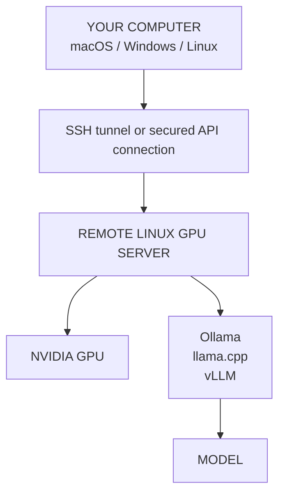

<p align="center">
  🇬🇧 <a href="README.md">English</a> &nbsp;|&nbsp; 🇻🇳 <a href="README.vi.md">Tiếng Việt</a> &nbsp;|&nbsp; 🇨🇳 <a href="README.zh-CN.md">中文</a>
</p>

<!-- SOURCE-REVISION: 3288716221 -->

---

<p align="center">
  
</p>

<h1 align="center">GPU Rental Kit</h1>

<p align="center">
  <strong>把租来的 NVIDIA GPU 云主机，变成开箱即用的自托管 LLM 服务器。</strong>
</p>

<p align="center">
  <a href="LICENSE"></a>
  <a href="https://github.com/TysonTranThai/gpu-rental-kit/releases"></a>
  <a href="https://github.com/TysonTranThai/gpu-rental-kit/actions"></a>
  
  
</p>

> [!IMPORTANT]
> **BETA — Windows 客户端支持尚未在真实 Windows 硬件上测试。**
> 目前仅通过静态校验（结构、语法、CI）；运行时测试待进行。
> macOS/Linux 服务器工作流已经稳定（[v1.3.0](https://github.com/TysonTranThai/gpu-rental-kit/releases/tag/v1.3.0)）。

> **核心理念：** 租来的 GPU 服务器负责运行模型。你自己的电脑——Mac、Windows PC 或 Linux 机器——只需连接这台服务器。**你的个人电脑不需要 NVIDIA GPU。**

> **工作流程：租用 → 安装 → 测试 → 运行。** 租一台 Linux GPU 云主机，用几条命令装好一切，验证机器正常，然后开始跑模型。

## 什么是 gpu-rental-kit？

`gpu-rental-kit` 把租来的 Linux NVIDIA GPU 机器的搭建过程自动化，用于本地/自托管的 LLM 推理。它帮你从一台全新的 GPU 云主机，快速变成一台可用的模型服务器，不必每次重复同样的手动配置。

它自动化或辅助完成：

- GPU 检测与 CUDA 校验
- Python 虚拟环境与支持 GPU 的 PyTorch
- Ollama、llama.cpp 和 vLLM 运行时
- Hugging Face 模型下载与模型别名
- OpenAI 兼容的推理服务器
- 可选的 Docker GPU 支持
- 存储与持久化诊断
- 备份、恢复助手、日志与健康检查
- 本地、模拟（mock）与真实远程测试

本项目**不绑定任何云厂商（provider-agnostic）**：只要是能给你 SSH 访问一台带可用 NVIDIA GPU 和网络的 Linux 机器，任何服务商都可以。

## 平台支持

这里涉及两个环境：

- **远程 GPU 服务器（REMOTE GPU SERVER）** — 运行 Linux，带 NVIDIA GPU、CUDA、Ollama/llama.cpp/vLLM、模型和推理 API。
- **本地用户电脑（LOCAL USER COMPUTER）** — Windows、macOS 或 Linux。运行面向用户的工具，通过 SSH/API 连接。它**不需要** NVIDIA GPU。

| 平台 | 本地客户端 | GPU 服务器 |
|---|:---:|:---:|
| Windows | ✅ | ❌ 当前版本 |
| macOS | ✅ | ❌ NVIDIA 服务器搭建 |
| Linux | ✅ | ✅ NVIDIA |

换句话说：你的电脑可以是上面三种系统之一，而租来的 Linux 机器负责运行 NVIDIA GPU。

### GPU 服务器

真正运行模型的租用机器必须满足：

**Linux + NVIDIA GPU + 可用的 NVIDIA 驱动**

工具包真实的 GPU 搭建流程运行在那台 Linux 服务器上。**macOS 只是开发/测试环境**，**Windows 在本版本中不是 GPU 服务器的目标系统**。两者都完全支持作为本地客户端平台——见下文。

## Windows 支持

**是的——Windows 是受支持的本地客户端平台。** 它自带安装器（`bootstrap.ps1`）和一套原生命令（`bin\*.ps1`）。

### 会安装什么

`bootstrap.ps1` 只准备本地客户端工具：

- 检查 PowerShell 版本、架构和 Windows 版本
- 校验必需工具：Git 和 OpenSSH 客户端
- 通过 **winget** 自动安装缺失的必需工具（可用时）
- 检测可选组件（Python、WSL2）并如实报告——都不是必需的
- 连接远程 GPU 服务器**从不要求** Docker Desktop
- 创建 `%USERPROFILE%\.gpu-rental-kit\` 及连接配置文件 `client.json`
- 把安装日志写入 `%USERPROFILE%\.gpu-rental-kit\install-*.log`

它只保存用于构造 `ssh` 命令的 host/port/user——绝不保存凭据。

### 如何安装

打开 **Windows Terminal**（推荐）或 PowerShell：

```powershell
git clone https://github.com/TysonTranThai/gpu-rental-kit.git
cd gpu-rental-kit
.\bootstrap.ps1
```

常用变体：

```powershell
.\bootstrap.ps1 -Help                                          # 完整帮助
.\bootstrap.ps1 -Yes                                           # 非交互式
.\bootstrap.ps1 -CheckOnly                                     # 只检测/报告，不做任何更改
.\bootstrap.ps1 -RemoteHost 203.0.113.7 -RemoteUser ubuntu     # 保存连接信息
```

如果 PowerShell 拒绝运行脚本，请对自己的账户放行一次：

```powershell
Set-ExecutionPolicy -Scope CurrentUser RemoteSigned
```

通常**不需要**管理员权限。只有安装（很少缺失的）OpenSSH Client 功能时才需要管理员窗口——脚本会明确告诉你要运行什么，而不是悄悄提权。

安装器是幂等的：先检查后安装，已有的 `client.json` 会被备份（绝不静默覆盖）。

### 如何连接 GPU 服务器

```text
Windows PC
   |
   | SSH / API (tunnel)
   v
Linux GPU VM
   |
   v
NVIDIA GPU
   |
   v
LLM
```

```powershell
ssh user@SERVER_IP
# 非默认 SSH 端口：
ssh -p 2222 user@SERVER_IP
```

在服务器上，一次性完成真正的搭建（见 [5 分钟快速上手](#5-分钟快速上手)）：

```bash
git clone https://github.com/TysonTranThai/gpu-rental-kit.git && cd gpu-rental-kit
./bootstrap.sh --remote-gpu
```

### SSH 隧道如何工作

模型服务器出于安全考虑，只绑定 LINUX 服务器上的 `127.0.0.1`。隧道把你的电脑上的一个端口转发到这个私有端点：

```powershell
ssh -N -L 8080:127.0.0.1:8080 user@SERVER_IP    # llama.cpp
ssh -N -L 8000:127.0.0.1:8000 user@SERVER_IP    # vLLM
```

保持该窗口打开。在第二个终端中验证：

```powershell
.\bin\api-status.ps1                 # 检查 http://127.0.0.1:<port>/v1/models
.\bin\api-status.ps1 -Port 8080      # 检查某个本地端口
```

### 如何使用模型

```powershell
.\bin\model-list.ps1                       # 服务器上有什么
.\bin\model-download.ps1 llama3.1-8b       # 远程下载
.\bin\ai-start.ps1 ollama llama3.1:8b      # 交互式远程会话
.\bin\model-run.ps1 llama3.1:8b            # 自动检测后端
.\bin\gpu-status.ps1                       # 远程硬件总览
.\bin\ai-stop.ps1                          # 停止运行时
.\bin\ai-backup.ps1 -Download              # 备份并拉取 tarball 到本地
```

`bin\*.ps1` 命令通过 SSH 在已配置的远程服务器上执行同名 bash 命令。它们明确标注为 `(REMOTE)`，**从不检查本地 Windows GPU**——`gpu-status.ps1` 报告的是服务器的 GPU，因为推理发生在那里。用 `-RemoteHost` 配置一次，或按会话使用 `$env:GRK_REMOTE_HOST='...'; $env:GRK_REMOTE_USER='...'`。

### 需要 WSL2、Docker Desktop 或 NVIDIA GPU 吗？

- **WSL2：** 可选，仅当存在时会被检测到；没有任何工作流要求它。
- **Docker Desktop：** 连接或使用远程 GPU 服务器**不需要**。
- **NVIDIA GPU：** Windows PC 上**不需要**——推理运行在租来的 Linux 服务器上。

## 5 分钟快速上手

### 1. 租一台 Linux NVIDIA GPU 云主机

选择一台带 NVIDIA GPU、可用驱动、SSH 访问、网络和足够磁盘空间的机器。Ubuntu 20.04/22.04/24.04 和 Debian 11/12 是主要支持环境。

### 2. SSH 登录 GPU 服务器

把用户名、主机和端口替换成你服务商提供的值：

```bash
ssh user@SERVER_IP
# 如果 SSH 使用非默认端口：
ssh -p 2222 user@SERVER_IP
```

### 3. 克隆仓库并引导服务器

在**远程 Linux GPU 服务器内部**运行这些命令：

```bash
git clone https://github.com/TysonTranThai/gpu-rental-kit.git
cd gpu-rental-kit
./bootstrap.sh --remote-gpu
```

无人值守运行：

```bash
./bootstrap.sh --remote-gpu -y
```

搭建过程设计为可重复运行，并会尽量复用已检测到的安装。它不会盲目安装 NVIDIA 驱动。

### 4. 验证机器

搭建完成后，打开新 shell 或加载命令路径，然后运行：

```bash
source ~/.bashrc
gpu-status
gpu-test
model-list
```

完整报告写入：

```bash
cat ~/ai/logs/machine-report.txt
```

### 5. 下载一个小模型

注册表包含 GGUF 和 Ollama 示例。对新手来说，Ollama 工作流最简单：

```bash
model-download llama3.1-8b
```

对 llama.cpp，下载一个 GGUF 别名：

```bash
model-download llama3-8b-gguf
```

用 `model-list` 查看可用别名，并记住下载模型会占用磁盘空间。

### 6. 开始推理

Ollama 是最容易上手的起点：

```bash
ai-start ollama llama3.1:8b
```

用主运行时时 llama.cpp 运行 GGUF 模型：

```bash
ai-start llama ~/ai/models/llama3-8b-gguf/llama-3-8b-instruct.Q4_K_M.gguf
```

用 vLLM：

```bash
ai-start vllm Qwen/Qwen2.5-7B-Instruct
```

### 7. 从你自己的电脑连接

对新手，让服务器保持绑定 localhost，并从 Mac、Windows PC 或 Linux 电脑创建 SSH 隧道。模型留在远程 GPU 服务器上；你的本地电脑只向它发送请求。

## 各部分如何协同工作



简单说：你的电脑是客户端，租来的 Linux 机器是模型服务器。服务器把模型加载进 GPU 显存并执行推理。SSH、API 请求或 SSH 隧道在两者之间传递请求和响应。

## 运行时选择

如果你是新用户，从 **Ollama** 开始。它提供最简单的模型下载和运行体验。

| 运行时 | 擅长什么 | 典型命令 |
|---|---|---|
| **Ollama** | 新手最友好的工作流和简单的模型管理 | `ai-start ollama llama3.1:8b` |
| **llama.cpp** | GGUF 模型、轻量服务、CUDA 加速和精细控制 | `ai-start llama /path/to/model.gguf` |
| **vLLM** | 高吞吐模型服务和 OpenAI 兼容 API | `ai-start vllm Qwen/Qwen2.5-7B-Instruct` |

**llama.cpp 是本项目的主要运行时。** Ollama 和 vLLM 是可选的替代方案。即使可选运行时不可用，可用的 llama.cpp 安装仍然是重要的基线。

## 语言选择

安装器的**第一步**（在任何安装输出之前）会询问你的首选语言：

```
Select your language / Chọn ngôn ngữ / 选择语言
  1) English
  2) Tiếng Việt
  3) 中文
```

支持的语言：`en`（English）、`vi`（Tiếng Việt）、`zh-CN`（简体中文）。

无人值守安装时，显式传入语言或通过环境变量设置——选择器会被跳过：

```bash
./bootstrap.sh --remote-gpu --lang vi
# 或
GPU_KIT_LANG=zh-CN ./bootstrap.sh --remote-gpu
```

你的选择会保存到 `~/ai/config/language.conf`，下次运行时自动复用（并附一个不打扰的"使用已保存语言？[Y/n]"询问）。显式的 `--lang` 始终优先。新增安装语言只需新建 `config/i18n/<code>.env` 目录并在 `config/i18n/languages.conf` 中加一行——无需修改安装器代码。

## AI 路由器（9Router + OmniRoute）

安装器可选地为你配置两个 OpenAI 兼容的 AI 路由器，它们位于你的模型服务器之前：

| 路由器 | 功能 | 默认端口 | 上游 |
|---|---|---|---|
| **9Router** | 本地仪表盘 + OpenAI 兼容 API 路由 | 20128 | [decolua/9router](https://github.com/decolua/9router) |
| **OmniRoute** | 多提供商路由仪表盘 | 20128 | [diegosouzapw/OmniRoute](https://github.com/diegosouzapw/OmniRoute) |

两者都通过 `npm install -g` 安装（9Router 需要 Node ≥ 18，OmniRoute 需要 Node ≥ 22——缺失时安装器会自动配置 Node 22），仅绑定 `127.0.0.1`，并在报告成功前通过健康检查。如果某个组件失败，总结会报告 `INSTALL FAILED` 及原因，而不是虚假的成功。

### 路由器管理

```bash
ai-router status              # 9Router: RUNNING / OmniRoute: STOPPED / ...
ai-router start 9router       # 启动单个路由器
ai-router stop omniroute      # 停止单个路由器
ai-router logs 9router        # 查看路由器日志
ai-router health omniroute    # HTTP 健康探测
```

`ai-start`（菜单选项 6）和 `ai-stop` 也能管理路由器。路由器是可选的：在 `~/ai/config/defaults.env` 中设置 `ROUTER_9ROUTER_ENABLED=no` / `ROUTER_OMNIROUTE_ENABLED=no` 可禁用，设置 `ROUTER_9ROUTER_PORT` / `ROUTER_OMNIROUTE_PORT` 可更改端口。

### 端口冲突

如果端口 20128 已被占用，安装器会询问：自动选择其他端口、停止冲突服务（需明确确认后）、或取消。它**绝不会**自动杀死未知进程。

### 远程访问（SSH 隧道）

路由器绑定在 GPU 服务器的 `127.0.0.1` 上。要从你自己的电脑访问它们，请打开 SSH 隧道：

```bash
# macOS / Linux
ssh -N -L 20128:127.0.0.1:20128 user@SERVER_IP

# Windows PowerShell
ssh -N -L 20128:127.0.0.1:20128 user@SERVER_IP
```

然后将浏览器或客户端指向 `http://127.0.0.1:20128`。把 `SERVER_IP` 替换为你的服务器地址；除非你理解相关安全影响，否则切勿将路由器暴露在 `0.0.0.0` 上——安装器绝不会自动打开防火墙端口。

## 多 GPU 支持

如果你的机器有多张 NVIDIA GPU，gpu-rental-kit 可以在**所选推理运行时支持**的情况下让它们协同工作。

### 一个模型跨多张 GPU（分片）

示例：2 × RTX 3090 = 24GB + 24GB ≈ **48GB 多张独立 GPU 的总 VRAM**。一张 GPU 放不下的模型可以分片到两张：

```bash
# 分片到所有 GPU：
model-run big-model --gpus all
# 分片到指定 GPU：
model-run big-model --gpus 0,1
# 让工具包根据估算的模型大小自动选择：
model-run llama3-70b --gpus auto --size-gb 40
# 运行前先看模型能不能放下：
model-run llama3-70b --fit --size-gb 40
```

各后端的处理方式：

| 后端 | 多 GPU 机制 | 说明 |
|---|---|---|
| **llama.cpp** | 跨可见 GPU 自动分层（layer split） | GGUF 层卸载；`CUDA_VISIBLE_DEVICES` 选择 GPU |
| **vLLM** | 张量并行（`--tensor-parallel-size N`，自动注入） | 需要合适的模型架构 |
| **Ollama** | 自动把大模型拆分到可见 GPU | 无需手动参数 |
| **PyTorch** | `CUDA_VISIBLE_DEVICES` / 按设备张量 | 工具包用它做选择和测试 |
| **Docker** | `NVIDIA_VISIBLE_DEVICES=all` 或 `0,1` | 见 `docker/compose.yml` |

### 自动选择 GPU（`--gpus auto`）

自动模式绝不盲目占用所有 GPU。它会检查当前正在运行的任务，优先选择能装下估算需求的最小一组同型号高显存 GPU，并解释自己的决定：

```bash
model-run llama3-70b --gpus auto --size-gb 40
```

在一台 2 × RTX 3090（24GB）+ RTX 3050（8GB）的机器上运行约 40GB 的模型，工具包会选择两张 3090 并告诉你原因：

```text
GPU system:
  3 GPU(s) detected
  GPU 0: NVIDIA GeForce RTX 3090 — 24GB
  GPU 1: NVIDIA GeForce RTX 3090 — 24GB
  GPU 2: NVIDIA GeForce RTX 3050 — 8GB
Model estimated requirement: ~40 GB (ESTIMATE — includes headroom; not a guarantee)
Recommended configuration: GPU 0 (NVIDIA GeForce RTX 3090, 24GB), GPU 1 (...)
Reason: ...
GPU 0: enabled
GPU 1: enabled
GPU 2: excluded — not needed — the model fits on the selected GPUs
```

自动模式也会尊重正在运行的任务：当剩余 GPU 足以覆盖模型时，会避开已有计算进程的 GPU（另一个 LLM、ComfyUI、embeddings、训练等）。

分片与负载并行可以显式强制：

```bash
model-run M --gpus 0,1 --gpu-mode shard      # 一个模型跨两张 GPU（默认）
model-run M --gpus 0,1 --gpu-mode workload   # 绝不分片：从集合中选最佳单张 GPU
```

基于环境变量的配置也有效（仅在没有显式参数时使用）：

```bash
GPU_MODE=auto GPU_IDS=0,1 model-run llama3-70b --size-gb 40
GPU_IDS=all model-run big-model              # 限制可见 GPU 集合
```

启动后，验证运行时确实在使用请求的 GPU：

```bash
gpu-status --expect 0,1
```

这会报告 REQUESTED / VISIBLE / ACTIVE GPU，并在某张被请求的 GPU 没有分配任何计算内存时发出警告——只有当预期的 GPU 真正承载了模型内存，多 GPU 启动才算成功。

### 混合 GPU（异构配置）

**可以——同一台机器里不同型号的 NVIDIA GPU 是受支持的。** RTX 3090 + RTX 3050（24GB + 8GB = 32GB *聚合* VRAM）可以工作，但要想想*怎么*用：

- **策略 A——模型分片：** 一个模型拆分到两张 GPU。llama.cpp 支持；按显存比例分配权重（工具包建议 `--tensor-split 24,8`）。较小的 GPU 既贡献显存，也是速度瓶颈。
- **策略 B——分离负载（通常更好）：** RTX 3090 跑主模型，RTX 3050 跑 embeddings / reranker / 更小的模型。不同 GPU 干不同的活，完全绕开瓶颈。

gpu-rental-kit 会自动对机器分类（`gpu-status` 显示配置类型）：

| 配置 | 示例 | 含义 |
|---|---|---|
| `single` | 1 × RTX 3090 | 一张 GPU |
| `homogeneous` | 3 × RTX 3090 | 相同 GPU |
| `heterogeneous` | RTX 3090 + RTX 3060 | 同架构、不同显存/型号 |
| `mixed-architecture` | RTX 3090 + RTX 4090 | 不同架构（如 Ampere + Ada） |

各后端对异构的判定（所选 GPU 集合为混合时由 `model-run` 显示）：

| 后端 | 异构分片 | 工具包判定 |
|---|---|---|
| **llama.cpp** | 跨不同 GPU 分层/张量拆分 | SUPPORTED（建议按显存比例拆分） |
| **Ollama** | 自动拆分，无法手动控制 | PARTIAL |
| **vLLM** | 张量并行要求相同 GPU | CAUTION — 建议用 llama.cpp 或负载分离 |
| **PyTorch** | 模型相关的多 GPU 代码 | SUPPORTED（设备选择） |
| **Docker** | 暴露全部/选定 GPU；由内部后端决定 | SUPPORTED |

判定反映各后端已文档化的行为。未在真实多 GPU 硬件上验证的能力会标为 NEEDS VERIFICATION，而不会升级为 SUPPORTED——见 [测试](#测试)。

### 基准测试（可选）

```bash
gpu-test --bench        # 微基准：每张 GPU 的 matmul GFLOPS + P2P 带宽
```

`--bench` 默认从不运行。它报告的是原始计算和拷贝数字——这些**不是**语言模型的 tokens/s，不能单独用来预测端到端 LLM 速度。

### 不同 GPU 运行不同模型（负载并行）

每张 GPU 一个负载——不涉及分片：

```bash
model-run model-a --gpu 0
model-run model-b --gpu 1
```

### 查看 GPU

```bash
gpu-list              # 每张 GPU：名称、显存、计算能力、PCI 总线
gpu-topology          # NVLink/PCIe 互联（平台报告时）
gpu-status            # 实时状态，含每张 GPU 使用率和 MULTI-GPU 模式
gpu-test --multi      # 更深的多 GPU 测试（每张 GPU 的 CUDA、P2P 报告）
```

### 重要——多 GPU 能做什么、不能做什么

> **聚合 VRAM 不是被合并的显存池。** 2 × 24GB 提供的是两张独立 GPU 上约 48GB 的*聚合*内存——它**不会**变成一张 48GB 的 GPU。模型能否利用这份聚合内存，取决于后端的分片/卸载支持以及模型架构。

- **多 GPU 并不等于 2 张 GPU = 2 倍速度。** 性能取决于模型、后端、张量并行、互联方式（PCIe vs NVLink）、批大小、上下文长度和负载。多 GPU 往往只是让模型*放得下*，而不是让它更快。
- **混合 GPU 可用，但较小/较慢的 GPU 会成为瓶颈。** gpu-rental-kit 会检测混合配置并警告你。
- **默认永远是单 GPU。** 只有当你显式传入 `--gpus` 时才启用多 GPU。已有的 `CUDA_VISIBLE_DEVICES` 值始终被尊重。

## Windows 用户

### 我能在 Windows 上使用吗？

**可以。** 租一台 Linux NVIDIA GPU 服务器，从 Windows 连接它，然后在 Linux 服务器上运行 GPU 搭建。你的 Windows 电脑是客户端；它不会原生运行 Linux GPU 搭建，也不需要 NVIDIA GPU。

Windows 10 和 11 通常通过 Windows Terminal 或 PowerShell 自带 OpenSSH：

```powershell
ssh user@SERVER_IP
# 非默认 SSH 端口：
ssh -p 2222 user@SERVER_IP
```

连接后，在服务器上运行：

```bash
git clone https://github.com/TysonTranThai/gpu-rental-kit.git
cd gpu-rental-kit
./bootstrap.sh --remote-gpu
```

要通过 SSH 隧道使用 API，另开一个 Windows Terminal 窗口并转发服务器的 localhost 端口。以 llama.cpp 的默认端口为例：

```powershell
ssh -N -L 8080:127.0.0.1:8080 user@SERVER_IP
```

保持该窗口打开。Windows 应用随后可以把 `http://127.0.0.1:8080` 作为隧道的本地端点使用。WSL2 是**可选**的，不是必需的；Windows Terminal、PowerShell 和 OpenSSH 足够完成 SSH 工作流。

## macOS 用户

Mac 可以管理和使用远程 GPU 服务器，而且不需要 NVIDIA GPU。**不要**在 macOS 上运行 `./bootstrap.sh --remote-gpu`。相反，SSH 登录 Linux GPU 服务器并在那里运行：

```bash
ssh user@SERVER_IP
git clone https://github.com/TysonTranThai/gpu-rental-kit.git
cd gpu-rental-kit
./bootstrap.sh --remote-gpu
```

在 macOS 上，不带 `--remote-gpu` 运行 `./bootstrap.sh` 会打开开发菜单——与 Windows 的 `bootstrap.ps1` 等效的本地引导体验。你也可以直接运行对 Mac 安全的检查：

```bash
./bootstrap.sh --validate
./bootstrap.sh --test
```

要把 llama.cpp 的默认 API 端口转发到你的 Mac：

```bash
ssh -N -L 8080:127.0.0.1:8080 user@SERVER_IP
```

然后在隧道开启时，从 Mac 应用使用 `http://127.0.0.1:8080`。

## 远程 API 访问

各运行时使用对 localhost 安全的默认值：

- **llama.cpp：** `127.0.0.1:8080`
- **vLLM：** `127.0.0.1:8000/v1`
- **Ollama：** `127.0.0.1:11434`

### A. SSH 隧道——新手推荐

在你的个人电脑上运行：

```bash
# llama.cpp
ssh -N -L 8080:127.0.0.1:8080 user@SERVER_IP

# 或 vLLM
ssh -N -L 8000:127.0.0.1:8000 user@SERVER_IP
```

远程服务保持私有，你的本地应用连接到 `localhost`。

### B. 公网 IP 和端口——进阶

你可以刻意把服务绑定到 `0.0.0.0` 并放行服务商的防火墙端口，但不建议在首次搭建时这样做。在支持的地方配置认证，并限制来源 IP。未经仔细加固的网络设计，不要把 Ollama 的原始端口 11434 暴露到公网。

### C. 域名 + HTTPS——进阶/未来部署

对于长期运行的公网服务，在模型服务器前面放一个带认证的 HTTPS 反向代理，并加上 TLS、防火墙限制、限流、监控和备份。SSH 隧道不需要域名。

## OpenAI 兼容 API：这意味着什么

OpenAI 兼容 API 是一个 HTTP 接口，提供 `/v1/chat/completions` 等熟悉的端点。知道如何与 OpenAI API 通信的应用，通常可以被配置为把推理请求发送到你的远程 vLLM 或 llama.cpp 服务器，而不是在本地运行模型。

它只提供**模型推理**。它**不会**自动让远程模型访问你个人电脑上的文件、终端、文件系统、Git 仓库或其他工具。

请把角色分开：

- **模型服务器：** 加载模型并生成响应。
- **本地客户端：** 拥有本地工具、文件、终端和 Git 访问权。

任何工具访问都必须由客户端应用有意实现并授权。

## 安全警告

> **绝不要把未认证的 LLM API 暴露到公网。**

推荐的优先级顺序：

1. 个人访问使用 SSH 隧道。
2. 如果需要公网访问，使用 HTTPS、认证、限流、防火墙/网络限制和仔细划定范围的反向代理。
3. 除非已明确加固，否则让 Ollama 的原始 `11434` 端口保持私有。
4. 绝不提交 API 密钥、服务商凭据或模型仓库令牌。

工具包默认把服务绑定到 `127.0.0.1`，不会自己打开公网端口，也不会盲目安装 NVIDIA 驱动。

本地能力隔离：把客户端连接到服务器，绝不会让该服务器访问你电脑的文件系统、shell 或凭据。在 Windows 上，这意味着 `C:\`、文档、桌面、SSH 密钥、浏览器数据和已存密码都留在你的 PC 上——无论服务器暴露什么 API，都不会自动与远程 GPU 服务器共享任何内容。未来任何 agent 风格的工具访问，都必须由你在客户端显式实现并授权。

## 存储与租期警告

租来的 GPU 机器可能是临时的。本地磁盘持久化取决于服务商和租用套餐。工具包有意报告：

```text
PERSISTENCE UNKNOWN — DO NOT RELY ON LOCAL STORAGE
```

在结束租用前：

- 用 `ai-backup` 备份配置和脚本
- 可行时用 `ai-backup --include-models` 备份重要模型/数据
- 把关键备份复制到租用机器之外
- 核实服务商的持久化策略，而不是假设磁盘在删除后仍然存在

## 命令参考

以下是搭建时安装到 `~/ai/bin` 的命令：

| 命令 | 用途 |
|---|---|
| `bootstrap.sh` | 搭建、校验和测试的主入口 |
| `gpu-status` | 显示 GPU、驱动、CUDA 和运行时状态（`--expect 0,1` 验证请求的 GPU 确实被使用） |
| `gpu-list` | 列出每张 GPU 的名称、显存、计算能力、PCI 总线和 UUID |
| `gpu-topology` | 显示 GPU 互联（NVLink/PCIe）和 NUMA 亲和性（报告时） |
| `gpu-test` | 运行 GPU 计算检查（`--multi` 多 GPU 测试，`--bench` 可选微基准） |
| `model-list` | 列出已注册的模型别名和已下载的模型 |
| `model-download` | 下载已注册别名、Hugging Face 模型或 Ollama 模型 |
| `model-run` | 用 Ollama、vLLM 或 llama.cpp 运行模型（`--gpu N`，`--gpus all\|0,1\|auto`，`--gpu-mode shard\|workload`，`--size-gb N`，`--fit`） |
| `model-stop` | 停止正在运行的模型进程 |
| `ai-start` | 启动 Ollama、vLLM 或 llama.cpp；GPU 参数（`--gpus 0,1`、`--gpu 0` 等）委托给 model-run |
| `ai-stop` | 停止当前活动的 AI 运行时 |
| `ai-info` | 显示 AI 环境信息 |
| `ai-backup` | 备份配置；`--include-models` 包含模型文件 |

Windows 对应命令位于 `bin\*.ps1`，使用相同的名称（`gpu-status.ps1`、`gpu-test.ps1`、`model-list.ps1`、`model-download.ps1`、`model-run.ps1`、`model-stop.ps1`、`ai-start.ps1`、`ai-stop.ps1`、`ai-info.ps1`、`ai-backup.ps1`），另有 `api-status.ps1` 用于隧道检查。它们通过 SSH 在已配置的远程服务器上执行——见 [Windows 支持](#windows-支持)。

其他有用的命令包括 `ai-logs`、`model-logs` 和 `model-stop`。

## 常见工作流

### 我刚租了一台 GPU

```bash
ssh user@SERVER_IP
git clone https://github.com/TysonTranThai/gpu-rental-kit.git
cd gpu-rental-kit
./bootstrap.sh --remote-gpu
source ~/.bashrc
gpu-status
gpu-test
```

### 我想运行 Ollama

```bash
model-download llama3.1-8b
ai-start ollama llama3.1:8b
```

Ollama 默认监听 localhost 端口 `11434`。用 SSH 隧道而不是把该端口暴露到公网。

### 我想用 llama.cpp

```bash
model-download llama3-8b-gguf
model-list
# 使用 ~/ai/models 中显示的实际 .gguf 路径：
ai-start llama ~/ai/models/llama3-8b-gguf/llama-3-8b-instruct.Q4_K_M.gguf
```

llama.cpp 是主要运行时，默认服务 localhost 端口 `8080`。

### 我想要一个 OpenAI 兼容 API

用 vLLM：

```bash
ai-start vllm Qwen/Qwen2.5-7B-Instruct
```

用 llama.cpp，使用 GGUF 文件：

```bash
ai-start llama ~/ai/models/my-model.gguf
```

然后用 SSH 转发相应的 localhost 端口。vLLM 使用 `http://127.0.0.1:8000/v1`；llama.cpp 使用 `http://127.0.0.1:8080`。

### 我想从 Windows 连接

```powershell
ssh -N -L 8080:127.0.0.1:8080 user@SERVER_IP
```

保持隧道开启，把本地客户端指向 `http://127.0.0.1:8080`。

### 我想从 Mac 连接

```bash
ssh -N -L 8080:127.0.0.1:8080 user@SERVER_IP
```

Mac 是客户端；租来的 Linux 机器是 GPU 服务器。

### 我的租期快结束了

```bash
ai-backup
ai-backup --include-models
ai-backup --list
```

在删除机器之前，把生成的备份文件复制到租用环境之外。

## 故障排查

| 症状 | 可能原因 | 诊断 | 下一步 |
|---|---|---|---|
| 安装时报 `sudo: command not found` | 服务商的最小化容器通常不带 sudo | `id -u`；`command -v sudo` | 以 root 运行？工具包会直接执行特权命令——无需 sudo。非 root？请以 root 重新运行，或安装 sudo（`apt-get install -y sudo`） |
| 未检测到 NVIDIA GPU | 机器/镜像不对、GPU 未挂载或服务商问题 | `nvidia-smi` | 确认租用包含 NVIDIA GPU，并向服务商询问直通（passthrough） |
| CUDA 不可用 | 驱动、CUDA/PyTorch 不匹配或环境损坏 | `nvidia-smi`；`~/ai/venv/bin/python -c 'import torch; print(torch.cuda.is_available())'` | 查看搭建日志；不要随意在服务商镜像上安装驱动 |
| SSH 连接被拒绝 | IP/端口错误、防火墙或 SSH 服务不可用 | `ssh -vvv -p PORT user@SERVER_IP` | 核对服务商连接信息并放行配置的 SSH 端口 |
| 端口已被占用 | 其他运行时或进程占用 8080/8000/11434 | `ss -ltnp \| grep -E ':8080|:8000|:11434'` | 用 `ai-stop` 停止旧服务，或换一个运行时端口 |
| 模型超出显存 | 模型权重/上下文超过可用 GPU 内存 | `gpu-status`；检查模型大小和显存 | 使用更小或量化模型、减小上下文，或换更大显存的 GPU |
| 磁盘空间不足 | 模型/缓存/日志填满租用磁盘 | `df -h`；`du -sh ~/ai/*` | 删除不用的模型/缓存，或租更大的磁盘 |
| Docker GPU 不可用 | Docker 或 NVIDIA Container Toolkit 缺失/不兼容 | `docker run --rm --gpus all nvidia/cuda:12.4.0-base-ubuntu22.04 nvidia-smi` | 使用原生执行，或安装与服务商兼容的 Docker GPU 组件 |
| 无法访问 API | 服务停止、端口错误或缺少隧道 | `curl http://127.0.0.1:8080/health`；`ss -ltnp` | 检查 `ai-logs`，启动正确的运行时并验证 SSH 隧道 |
| 安装在启动服务时卡住 | 最小化容器没有 systemd | `command -v systemctl` | 服务通过运行时包装器启动（`ai-start`、`llamacpp-serve`、`vllm-serve`）；无需 systemd |
| Ollama 安装失败 | 缺少解压前置条件或网络/软件包问题 | `command -v zstd`；`cat ~/ai/logs/setup-*.log` | 重新运行 bootstrap；zstd 在受支持的包管理系统上会自动处理 |
| Windows：脚本无法运行 | PowerShell 执行策略 | `Get-ExecutionPolicy -Scope CurrentUser` | `Set-ExecutionPolicy -Scope CurrentUser RemoteSigned`，然后重跑 `bootstrap.ps1` |
| Windows：缺少 winget | 没有 App Installer 的旧版 Windows | 在 PowerShell 中运行 `winget --version` | 手动安装 Git/SSH（git-scm.com、OpenSSH 功能）并重跑 `-CheckOnly` |
| Windows：找不到 ssh | 缺少可选的 OpenSSH Client 功能 | 在 PowerShell 中运行 `ssh -V` | 在管理员 PowerShell 中运行 Add-WindowsCapability -Online -Name OpenSSH.Client~~~~0.0.1.0 |
| Windows：隧道中 API 不可达 | 隧道关闭或端口错误 | `.\bin\api-status.ps1` | 重新打开 ssh 隧道窗口，确认端口与 llama.cpp（8080）/ vLLM（8000）匹配 |

查看日志：

```bash
ai-logs
model-logs all
cat ~/ai/logs/setup-*.log
```

## 常见问题

**我能在 Windows 上使用吗？**
可以——作为连接 Linux NVIDIA GPU 服务器的客户端。GPU 搭建本身在 Linux 上运行。

**我的电脑需要 NVIDIA GPU 吗？**
不需要。远程服务器可以运行模型，你的电脑只需连接它。

**我能用 Mac 吗？**
可以。把 Mac 作为客户端和开发/测试电脑，SSH 登录 Linux 服务器后再运行真正的 GPU 搭建。

**我能直接在 macOS 上运行 GPU 搭建吗？**
不能。不要在 macOS 上运行 `./bootstrap.sh --remote-gpu`。在本地使用对 Mac 安全的校验/测试工作流，远程运行 GPU 搭建。

**我需要 Docker 吗？**
不需要。原生执行是默认方式。Docker 支持仅对基于 Docker 的工作流可选。

**我需要域名吗？**
不需要。SSH 隧道通常最简单。公网 IP 和端口在适当的安全措施下也可用，域名是进阶的 HTTPS 选项。

**租期结束时我的模型还能保留吗？**
不保证。请核对服务商的持久化策略，并把重要模型和备份复制到别处。

**API 会自动让模型控制我的电脑吗？**
不会。API 只提供推理。本地文件、终端、工具和 Git 仍然是客户端侧独立的能力。

**从 Windows 使用 gpu-rental-kit 需要 WSL2 吗？**
不需要。`bootstrap.ps1` 使用原生 Windows 工具（PowerShell、Git、OpenSSH）。WSL2 仅在存在时被检测到，从不要求。

**我需要 Docker Desktop 吗？**
远程工作流不需要——连接和使用远程 GPU 服务器只需要 SSH 加一个 API 客户端。只有当你选择在服务器上走可选的 Docker 搭建路径时，Docker 才重要。

**`gpu-status.ps1` 显示的是我 Windows PC 的 GPU 吗？**
不是——它通过 SSH 显示远程 Linux 服务器的 GPU 状态，并诚实标注 `(REMOTE)`。Windows 客户端故意没有本地 NVIDIA 检查，因为推理运行在服务器上。

**如何在 Windows 上安装本地工具？**

```powershell
git clone https://github.com/TysonTranThai/gpu-rental-kit.git
cd gpu-rental-kit
.\bootstrap.ps1
```

它会通过 winget 安装缺失的前置条件，并在你传入 `-RemoteHost ...` 时写入 `%USERPROFILE%\.gpu-rental-kit\client.json`。

## 支持的环境与限制

- **GPU 运行时：** 带可用 NVIDIA 驱动和 CUDA 兼容 GPU 的 Linux
- **主要发行版目标：** Ubuntu 20.04/22.04/24.04 和 Debian 11/12
- **客户端电脑：** 通过 SSH/API 连接的 macOS、Windows 和 Linux
- **Linux 角色：** 既是远程 GPU 服务器安装（`bootstrap.sh --remote-gpu`），也是日常本地客户端使用
- **macOS：** 仅本地客户端 + 开发/测试环境；不进行 NVIDIA GPU 搭建
- **Windows：** 通过 `bootstrap.ps1` 成为一等本地客户端；本版本不是 Linux GPU 服务器目标
- **AMD/Intel GPU：** 本版本没有 ROCm 或 oneAPI 搭建路径
- **NVIDIA 驱动安装：** 有意不自动化，因为服务商镜像和重启各不相同
- **Docker：** 可选；原生执行不需要 Docker

## 项目结构

```text
gpu-rental-kit/
├── bootstrap.sh            # macOS 开发菜单 + Linux GPU 服务器入口
├── bootstrap.ps1           # Windows 本地客户端安装器（各平台对应版本）
├── setup.sh                # Linux GPU 搭建编排器
├── config/                 # defaults.env + models.yaml（共享概念配置）
├── scripts/                # 检测、搭建、运行时、备份、诊断（服务器）
├── bin/                    # bash 命令（服务器）+ .ps1 Windows 客户端对应版本
├── docker/                 # 可选的 Docker GPU 文件
├── docs/                   # 文档资源
└── test/                   # 本地、模拟和真实远程测试
```

## 测试

在开发电脑或 Linux 服务器上运行：

```bash
./test/run_all.sh local
./test/run_all.sh mock
./test/run_all.sh all
```

`local` 和 `mock` 不需要 NVIDIA GPU。真实 GPU 和远程测试需要配置了远程目标，没有时会如实跳过。测试框架会分别标记 mock、real、pass、fail 和 skipped 结果。

Windows 工具链有自己的测试入口（`test/tests/test_windows_client.sh`）：它会结构化校验每个 `.ps1` 文件，并在装有 `pwsh` 时用真正的 PowerShell 解析器解析它们。在没有 `pwsh` 的环境（例如 macOS CI 主机）中，校验保持静态，输出也会说明这一点——Windows 运行时结果从不被模拟。

贡献指南见 [CONTRIBUTING.md](CONTRIBUTING.md)。漏洞报告见 [SECURITY.md](SECURITY.md)。

## 参与贡献

欢迎各种贡献——修 bug、新增 mock GPU 配置、服务商搭建笔记和文档改进都很有价值。项目看重简洁、诚实和可移植性。

1. Fork 仓库并创建功能分支。
2. 做出修改，保持改动聚焦且经过充分测试。
3. 提交前运行测试套件：

   ```bash
   ./test/run_all.sh all
   ```

4. 提交 pull request，说明改了什么以及为什么。

完整指南（含 pull request 检查清单）见 [CONTRIBUTING.md](CONTRIBUTING.md)。

## 许可证

[MIT](LICENSE)——可自由使用、修改和分发。
